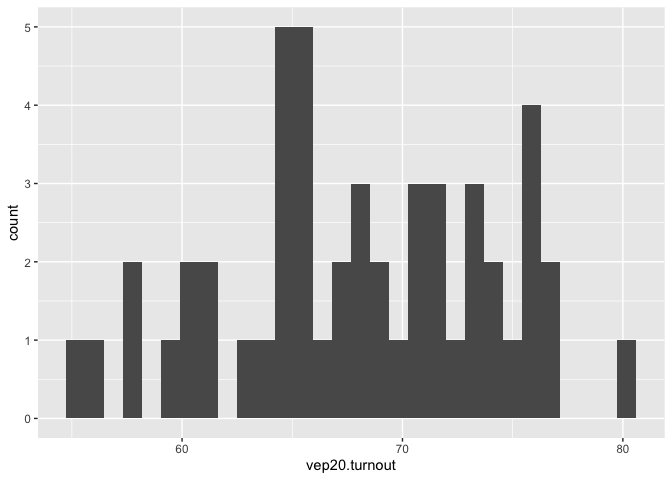
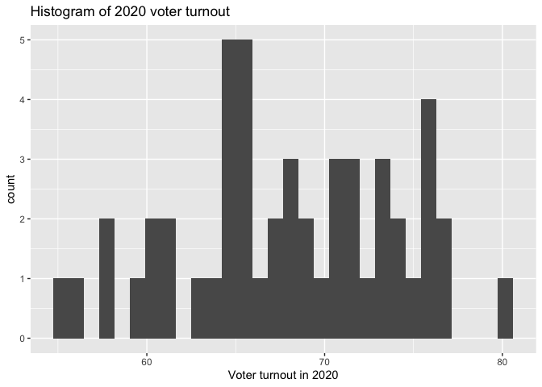
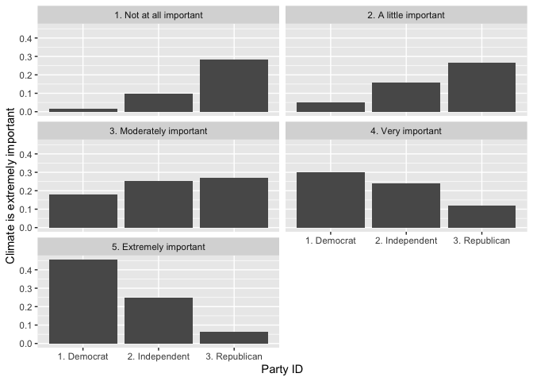
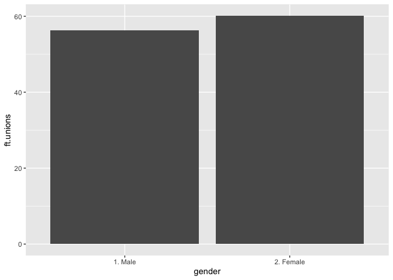
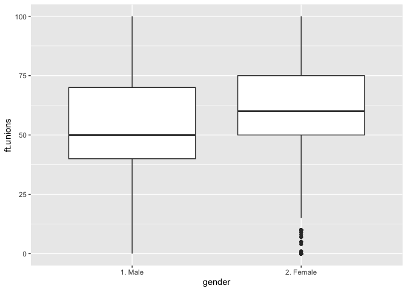
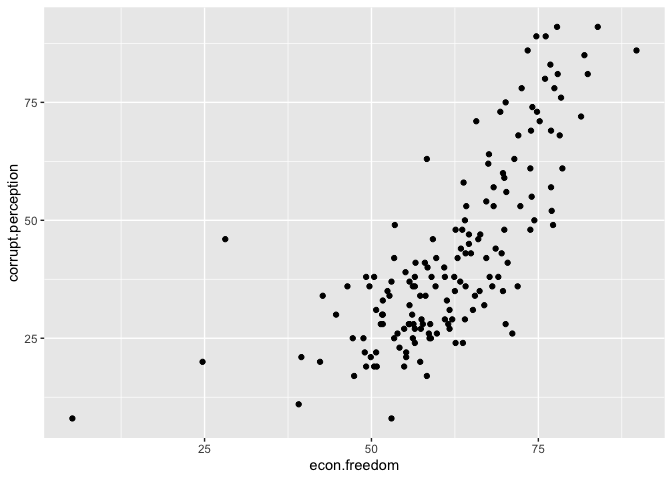

<style>
p.caption {
  font-size: 80%;
  font-style: italic;
  margin-bottom: 25px;
}
</style>





## Getting started with R and RStudio

[R](https://www.r-project.org/) is the stats software we'll be using in this course. [RStudio](https://posit.co/products/open-source/rstudio/) is a user-friendly interface for R that simplifies how you interact with R. Together, the software will allow you to manage data, conduct statistical analyses, create high-quality graphics, automate your research, and make your work reproducible, just to name a few features. 

If you haven't already, go ahead and [download R and RStudio](https://posit.co/download/rstudio-desktop/), and then install the software. The installation instructions are straightforward and, even better, the software is free to use. 

Once you've installed both programs you can launch RStudio like you would any other app. RStudio is able to directly interface with R so there's no need to launch the R app. 

Here's a screenshot of the RStudio interface with descriptive labels for each of the four panes. 


<div class="figure">

<p class="caption">The RStudio interface with labels</p>
</div>


Keep in mind that your interface could look a little different depending on the version you’re working with and any custom changes you make. You’ll become more familiar with why each feature is important, but for now here’s a quick rundown:

* Source. This is where your code files will live. We'll be using basic text files, called `.R` source files, that include a series of commands you want to run that we'll save for future use. In the most basic sense, commands tell R what you want it to do. When you're ready to run a command, you can do directly from the source pane.

* Console. This is where the code from your source file is sent and executed. After you issue a command, this is also where the output of the command will show up. The console is essentially what R looks like without RStudio. You can also interactively run commands here, which we'll cover later.

* Environments. Here you'll find a list of any dataframes you have loaded in R, along with other functions, vectors, plots, or tables you create. These are all listed in the environment tab and are collectively called objects. Don't worry to much about about the terminology for now, just remember that you'll find your data, plots, and tables listed here. 

* Output. There are several useful tabs in this pane. Here are the most important for now.
  + Files. Shows you all of the files in your current/working directory. The working directory is the location on your computer where R will look for files, like datasets. This is also the location where any files you save, like figures and tables, will end up. 
  + Plots. After you create figures you'll be able to view them here.
  + Help. You can view help files here after you use the `help()` command. 

One more thing before we get started. Some installations of RStudio will default to a setting that will always load what is called a workspace every time you start RStudio. This can be useful in some instances, but it's much more likely that this setting will cause problems down the road. Change this now! In the RStudio toolbar, go to Tools > Global Options. In the window that pops up, *uncheck* "Restore RData into workspace at startup" and set "Save workspace to RData on exit" to *never*. Here's what your settings should look like:


<div class="figure">

<p class="caption">Here's what your workspace settings should look like</p>
</div>


### Let's run some code

The first thing we'll do to get started is open a new R script file. Here's where to create a new script:


<div class="figure">

<p class="caption">Start a new script file</p>
</div>


After you have the new untitled blank file, save it to your computer. Make sure you note where it's being saved so you can find it later. 

We'll start with a very basic command where we do some simple addition. Just type the following four numbers into your script: `5 + 20 + 16 + 8`. Then, select the line you want to execute and click on Run.


<div class="figure">

<p class="caption">Run your code</p>
</div>


Here's what the code should look like, along with the result.


``` r
5 + 20 + 16 + 8
```

```
## [1] 49
```


We can easily calculate the mean of these values by making some minor changes to the previous code.


``` r
(5 + 20 + 16 + 8) / 4
```

```
## [1] 12.25
```


We are clearly just using R as a fancy calculator at this point, but let's see how we can use some built in functions to accomplish the same tasks.

First, let's create a vector that includes the values we used above. I named the object `mynums`, which we can then use to access the list of numbers.


``` r
mynums <- c(5, 20, 16, 8)
mynums
```

```
## [1]  5 20 16  8
```

Now we can use `mynums` to sum the numbers and calculate the mean. There are also many other potentially useful functions we can use to get info about the `mynums` series.


``` r
# Addition.
sum(mynums)
```

```
## [1] 49
```

``` r
# Average.
mean(mynums)
```

```
## [1] 12.25
```

``` r
# Median.
median(mynums)
```

```
## [1] 12
```

``` r
# Minimum.
min(mynums)
```

```
## [1] 5
```

``` r
# Maximum.
max(mynums)
```

```
## [1] 20
```

``` r
# Standard deviation.
sd(mynums)
```

```
## [1] 6.946222
```

``` r
# Notice how R ignores everything after the '#' symbol.
```


In the above example, we use the built in functions `sum` and `mean` to easily get the sum and average of the list of numbers included in the `mynums` object we created earlier. We also included examples of some other commonly used functions. Head to this post on [Basic Functions in R](https://www.r-bloggers.com/2021/04/basic-functions-in-r/) for more details on functions in R.


### Using comments in your script file

You may have noticed the `#` symbol included in the script file commands that describe the purpose of each line of code. R will ignore anything your write after the `#`. This is how we can add comments to our script files, which will be very important once you start to work on larger projects. Consistently using comments in your code will help serve as a reference for why you did what you did in your script file. It will also help other researchers using your code to understand the logic behind your coding approach. 


### Now let's try with a dataset

In the above examples we used some very simple examples to get us started with running code and using functions in R. Of course, the series of numbers we used were just data we made up. Now, let's use some real data and start learning the basics of analysis with R. 

For most of this tutorial we'll be using data provided by the authors of the excellent [Essentials of Political Analysis](https://collegepublishing.sagepub.com/products/the-essentials-of-political-analysis-6-256992). The data are available as an R package called `RCPA3`. Packages are a very important part of R that give us many additional functions and tools created by other R users. In fact, one of the first things we'll do when starting a new script file is to download and load a handful of commonly used packages. 

The first time using a package you'll have to download it to your computer using the `install.packages()` command. Then, once the package is downloaded you'll use the `library()` command to load/attach it to your current R session.

In addition to using the datasets from the `RCPA3` package, we'll also being using the `tidyverse` package. Tidyverse is actually a collection of several packages that we'll use frequently. These tools will help make working with with your data much easier. This is particularly true when transforming and managing your data. Data transformation is the focus of later sections in this tutorial where we'll talk more about the tidy approach to data processing. The `tidyverse` package also includes `ggplot2`, which provides the functions we'll be using for data visualizations.


``` r
# Download the packages. 
# You should only have to do this once if you use the same computer.
install.packages("RCPA3")
install.packages("tidyverse")
```


``` r
# Load the packages.
library(RCPA3)
library(tidyverse)
```

Once the packages are loaded, we can take a look at the datasets that are included with the `RCPA3` package. We will mainly be working with with three different datasets: data on the 50 states (called `states`), opinion data from people surveyed by the American National Election Studies (called `nes`), and data on over 160 countries around the world (called `world`). Here are a few functions you'll want to use when you get started with a new dataset. Let's take a look at the `states` data, which includes numerous variables for each of the 50 states.


``` r
# Get more info about a function. 
# In this case, it's info about the states data.
help("states")

# Get the names of the variables in the dataframe.
names(states)

# Additional info about the variables in the dataframe.
glimpse(states)
```


The above functions are useful when getting acquainted with the structure of the data. Notice that with the `glimpse()` function we are given the variable names, type, and example values of the variable. Also, the first lines of output from `glimpse` provides the number of rows and columns of the dataframe. This is equivalent to the number of *observations* (rows) and *variables* (columns) in the data.

It can also be helpful to use RStudio's built-in data viewer so you can browse the data like you would in the form of a spreadsheet.


``` r
# Browse the dataframe in RStudio's built-in viewer.
View(states)
```


After using the `View()` function, you should have a new tab that includes the spreadsheet-style data viewer. It's important to note the structure of the dataframe. In the screenshot it's annotated to show that our data should always be organized so that our columns are variables and rows are our observations. This will be a particularly useful rule to follow if you are collecting or using data that are not already in R data format. This structure is also an essential requirement for keeping your data in tidy format. In other words, as long as you make sure your columns are variables and rows are observations, your data will be compatable with the tidyverse tools we'll be using.


<div class="figure">

<p class="caption">Data viewer</p>
</div>


Now that we have some data to work with, let's do some basic data visualization. We'll start with a histogram, which provides an overview of a variable's distribution. The variable we'll plot is `vep20.turnout`, which is the state voter turnout rate in 2020.


``` r
# Histogram of voter turnout.
# First line includes data and variable to plot.
# Second line plots using the histogram.
fig.hist <- ggplot(states, mapping = aes(x = vep20.turnout)) +
  geom_histogram()
fig.hist # Run the object we created to show the plot.
```

<!-- -->


It's also easy to add labels to the figure. The code below adds a third line to the histogram code we used so that the plot now includes an x-axis label and title.


``` r
# Histogram of voter turnout, now with labels.
fig.hist <- ggplot(states, mapping = aes(x = vep20.turnout)) +
  geom_histogram() +
  labs(x = "Voter turnout in 2020",
       title = "Histogram of 2020 voter turnout")
fig.hist 
```

<!-- -->


Now let's plot a relationship. As an example, we might be interested in whether state voter turnout is related to state educational attainment. The `hs.or.more` variable is the percentage of those over 25 years of age who have earned at least a high school degree.


``` r
# Plot of the relationship between education and voter turnout.
# This is a scatterplot.
fig.scat <- ggplot(states, mapping = aes(x = hs.or.more, y = vep20.turnout)) +
  geom_point() + 
  geom_smooth(method = "lm") +
  labs(x = "Voter turnout in 2020",
       y = "% With high school degree or more")
fig.scat
```

<!-- -->


In this figure we also included the `geom_smooth()` option. This gives the estimated linear relationship between voter turnout and education levels.


## Describing variables

It’s typically a good idea to learn about the basic characteristics of the variables in a dataset, particularly when you’re using secondary data. This can be done by obtaining the descriptive statistics for the variables you plan on using, which includes measures of central tendency (e.g., mean, median, and mode) and dispersion (e.g., variance and standard deviation).

The method you use to describe a variable will depend on the variable’s level of measurement. Remember, the only measure of central tendency that is appropriate for a nominal variable is the mode, which we define as the most frequently occurring value. For ordinal variables, we can use the mode or the median. The mode, median, and mean can all be used for continuous variables, but it typically makes sense to focus on the mean and median of continuous variables. Importantly, together the mean and median can tell us about the symmetry of the variable’s distribution.

In the previous section we used the `glimpse()` command to get basic information about the variables in the `states` dataset, which includes the variable type. Variable types in R datasets can include numeric, integer, character, and factor. The variable type will not always correspond to the variable metric, but it can help with identifying the metric and is important to know when analyzing your data. It's also important to keep in mind that a variable can be stored as a variable type that isn't ideal for your analysis. When this happens we have to change the type, which will be covered in the data transformation section. For now, just keep in mind that the data you're using may not always be structured in a way that works best for you.

One way to get the descriptive statistics we want is to calculate them using the R functions we used in the intro section. When we're working with datasets, we can use `summarize()` to get statistics for each variable we are working with. For this example we will again be using the `states` dataset from the `RCPA3` package, as well as the `tidyverse` package.


``` r
library(RCPA3)
library(tidyverse)

states %>% # Dataset we want to use.
  summarize(mean_vep = mean(vep20.turnout)) # Get the mean.
```

```
##   mean_vep
## 1   67.948
```


A quick note on this code. This is the first time we are using `%>%`, which is called a *pipe operator* in tidy data language. The idea is that it allows you to "pipe" an object forward to one or more additional functions. For this example we start with the `states` dataset, then use `summarize()` to specify which statistics we want to calculate. 

Here we get the mean of the voter turnout variable `vep20.turnout`, which we named `mean_vep`. It's fairly straightforward to add other calculations. For instance, let's also get the median and standard deviation of `vep20.turnout`. 


``` r
states %>% 
  summarize(mean_vep = mean(vep20.turnout),
            med_vep = median(vep20.turnout),
            sd_vep = sd(vep20.turnout)) 
```

```
##   mean_vep med_vep   sd_vep
## 1   67.948      68 5.971949
```


Notice that within the `summarize()` function we separate each calculation with a comma. This approach works fine if we're working with a small number of variables, but can become cumbersome as we add variables and statistics. And we might also want to include non-continuous variables in a summary of our descriptive statistics.

We'll use the `skimr` package to simplify the process of producing descriptive statistics and putting them together in a nicely formatted table. It let's us customize the what we include in the summary table and also makes it fairly easy to save (or export) the tables we create (for example, in ms word format). We'll also need to create some tabulations of our nominal and ordinal level variables. For tabulations we'll use the `janitor` package. 

Let's give it a try. Similar to the other packages we've used, you'll have to install `skimr` and `janitor` the first time you use them. We'll also be using the `RCPA3` and `tidyverse` packages, which were loaded above. 


``` r
# First install packages if you haven't already.
#install.packages("skimr")
#install.packages("janitor")

# Load the packages.
library(skimr)
library(janitor)

states %>% # Dataset we want to use.
  skim(vep20.turnout, region, cig.tax.3cat) # Select variables we want stats for.
```

```
## ── Data Summary ────────────────────────
##                            Values    
## Name                       Piped data
## Number of rows             50        
## Number of columns          149       
## _______________________              
## Column type frequency:               
##   factor                   2         
##   numeric                  1         
## ________________________             
## Group variables            None      
## 
## ── Variable type: factor ───────────────────────────────────────────────────────
##   skim_variable n_missing complete_rate ordered n_unique
## 1 region                0             1 FALSE          4
## 2 cig.tax.3cat          0             1 FALSE          3
##   top_counts                       
## 1 Sou: 16, Wes: 13, Mid: 12, Nor: 9
## 2 Med: 29, Low: 12, Hig: 9         
## 
## ── Variable type: numeric ──────────────────────────────────────────────────────
##   skim_variable n_missing complete_rate mean   sd p0  p25 p50  p75 p100 hist 
## 1 vep20.turnout         0             1 67.9 5.97 55 64.5  68 72.8   80 ▃▆▇▇▅
```

In the command above we again start with the `states` dataset, then use `skim()` to choose the variables from the `states` dataset we want to work with and get our descriptive statistics for those selected variables. In the example we are asking for descriptive statistics on voter turnout in the states, state region, and data on cigarette tax policies.

The first thing you might notice about the output is that `skim()` gives us different statistics depending on the variable measurement metric. In this case we have variables that fall into the factor type and numeric type. The variables `region` and `cig.tax.3cat` are both categorized by `skim()` as factors even though `region` is nominal and `cig.tax.3cat` is categorical. For the factor variables the output gives us very basic information about the variables, like the number of total categories and common values. Below we'll address why we will want different descriptive statistics for these different levels of measurement. 

We can see that `vep20.turnout` is the only variable in the numeric section of the output. This is because the variable measures voter turnout in percentages, which can be considered a continuous variable. The output for numeric measures includes each variable's mean, standard deviation, and various percentiles. The percentiles included here are particularly helpful since they include the minimum and maximum, the median, and what is sometimes referred to as the *interquartile range*, or IQR. IQR is just a fancy way of saying the 25th and 75th percentiles. Finally, `skim()` also gives a mini histogram for each variable.

Keep in mind that the `skim()` function will always include variables that take on numeric values in the numeric section, even if the variable shouldn't be summarized using descriptive statistics for continuous measures.

The `skim()` command provides a number of descriptive statistics we might need for our variables, but there are limitations to the information we can get for categorical level variables. We might need, for instance, an easy way to determine the median value of an ordinal level variable. (Why can't we use the median for our nominal level variable?) Frequency tables work well for this task, and they will also be essential when analyzing some bivariate relationships. Let's create a tabulation of the `cig.tax.3cat` variable using the `tabyl()` function from the `janitor` package. 


``` r
states %>%
  tabyl(cig.tax.3cat)
```

```
##      cig.tax.3cat  n percent
##    Low (under $1) 12    0.24
##  Medium ($1 - $3) 29    0.58
##    High (over $3)  9    0.18
```


This gives us a standard tabulation, which is nice but is essentially the same information given by `skim()`. The table will also include a valid percent column when your data has missing values (this variable doesn't). It would be really helpful to also have a cumulative percentage column given that `cig.tax.3cat` is an ordinal level variable. This is easily done by adding a line using `mutate()` and the `cumsum()` functions.


``` r
states %>%
  tabyl(cig.tax.3cat) %>%
  mutate(cumu_percent = cumsum(percent))
```

```
##      cig.tax.3cat  n percent cumu_percent
##    Low (under $1) 12    0.24         0.24
##  Medium ($1 - $3) 29    0.58         0.82
##    High (over $3)  9    0.18         1.00
```


We use `mutate()` when we want to change or create a new variable. The `cumsum()` function just returns the cumulative sum of whatever variable we pass to it, in this case we wanted the cumulative sum of the percentage column. 

Now that we have the cumulative percentage, we know that the "Medium" category is the median value of the cigarette tax variable. (Remember, for the median value think 50th percentile.)

For some data, it can also be useful to give examples of which observations have high values and which have low values. For instance, we might be interested in which states have the highest and lowest levels of voter turnout. Here is one of many ways to accomplish this using `arrange()`.


``` r
states %>%
  select(state, vep20.turnout) %>%
  arrange(vep20.turnout)
```


You'll notice that this set of commands selects the variables `state` and `vep20.turnout`, then uses `arrange()` to sort these variables from lowest to highest by values of `vep20.turnout`. Now we can easily identify the states with low and high voter turnout. 

In this example our data only includes 50 observations, so when the commands return the entire dataset it isn't much of an issue. But if we had more observations we might want to limit the output to only a select number of low and high observations. We can do this using the `head()` and `tail()` functions. 


``` r
states %>%
  select(state, vep20.turnout) %>%
  arrange(vep20.turnout) %>%
  head(n = 5)
```

```
##            state vep20.turnout
## 36      Oklahoma          55.0
## 4       Arkansas          56.1
## 11        Hawaii          57.5
## 48 West Virginia          57.6
## 42     Tennessee          59.8
```


``` r
states %>%
  select(state, vep20.turnout) %>%
  arrange(vep20.turnout) %>%
  tail(n = 5)
```

```
##         state vep20.turnout
## 47 Washington          75.7
## 49  Wisconsin          75.8
## 19      Maine          76.3
## 6    Colorado          76.4
## 23  Minnesota          80.0
```


This example gives us the 5 lowest and then 5 highest turnout states, but we could get any number by changing the value of the `n=` option.

Finally, depending on the data and variables you're interested in describing, plotting your data can be very useful. In the last section we created a basic histogram of the `vep20.turnout` variable. 


``` r
# Histogram from the last section.
fig.hist <- ggplot(states, mapping = aes(x = vep20.turnout)) +
  geom_histogram()
fig.hist 
```


Histograms work well for continuous measures, but aren't designed for categorical data. The most common type of plot for ordinal and nominal level variables is the bar plot. 

Since we already know how to create frequency tables, we'll use these tables for plotting.


``` r
# Save frequency table as an object called "tabcig".
tabcig <- states %>%
  tabyl(cig.tax.3cat) 
  
# Use the object for the bar plot.
fig.bar <- ggplot(tabcig, mapping = aes(x = cig.tax.3cat, y = percent)) +
  geom_col() +
  labs(x = "State cigarette tax policies",
       y = "Percent")
fig.bar 
```

<!-- -->


Plotting our variables is a useful way of visualizing the properties of the data in addition to using descriptive statistics. 


## Data transformation

Whether you’re using data you’ve collected on your own (primary data) or data collected by another researcher (secondary data), you’ll almost always have to make changes to the data. There are a few main reasons why you have to modify existing data. The first is when you have to alter variables so that they can more effectively be used to make descriptive inferences or to analyze relationships, which is sometimes referred to as “cleaning” the data. This typically needs to be done when a variable takes on values that you believe don’t belong in an analysis, like categories for missing data, or if you want to reverse the scale of a variable. 
Another situation you’ll encounter is when you want to combine the values of a variable into a smaller number of useful categories. A third scenario is when you have several variables that tap into aspects of the same concept and you want to combine these variables into single variable that more accurately measures the concept. In other words, using several indicators to create an index. Finally, you might want to create several indicator (or dummy) variables based on the categories of a nominal or ordinal level variable.

Here are some basic rules to follow when you do have to make changes to variables:

1. Avoid changing the original data file.

1. Examine the original data before creating a new variable.

1. Check your work after making a change.

1. Properly label any new variables you create.


### Rescaling variables

One common type of transformation is changing the scale a variable is measured on. An example of this is when we have a variable that is measured in percentages that we want to be scaled to proportions (or vice versa). Another is when we need a variable measured in dollars that we would like to be scaled to thousands of dollars. 

Let's see how to perform one of these transformations using the `states` dataset. We'll transform the `schools.avg.salary` variable, which is the average salary of school teachers in each state measured in dollars. It might be easier to understand the measure if we scale it so the values are represented in thousands of dollars. We'll be using the `RCPA3` and `tidyverse` packages.


``` r
library(RCPA3)
library(tidyverse)

states <- states %>%
  mutate(schoolsal1k = schools.avg.salary / 1000)
```


This code first uses the `<-` assignment operator to replace the already existing states dataset so that the new variable we create is added to the data. The new variable is created using the mutate function, which allows us to change and add variables to a dataframe. We call the new variable `schoolsal1k` and make it equal to `schools.avg.salary` divided by 1000 using `/`. Looking at the two variables side-by-side we can see how they differ.


``` r
# Check the new variable.
states %>%
  select(schoolsal1k, schools.avg.salary) %>%
  head(n=10)
```

```
##    schoolsal1k schools.avg.salary
## 1       48.518              48518
## 2       67.443              67443
## 3       47.218              47218
## 4       48.218              48218
## 5       77.179              77179
## 6       46.155              46155
## 7       72.013              72013
## 8       59.960              59960
## 9       49.199              49199
## 10      54.190              54190
```


We only used division in this example but we could use a number of math operators depending on what we need. The table below includes a list of commonly used operators in R.


Table: Mathematical operators in R

| Operator | Description              |
|:----------|:--------------------------|
| +         | Addition        |
| -         | Subtraction     |
| *         | Multiplication  |
| /         | Division        |
| ^         | Exponent        |


### Reversing a variable's scale

There are also instances where it makes sense to reverse the scale of an existing variable in our dataset. A common reason for this kind of transformation is when a variable is coded so that higher values indicate less of the concept being measured. In these cases it's a good idea to reverse the scale to avoid confusion and issues with interpretation. For an example of this we can look at the `giffords.rank` measure in the `states` dataset, which provides a state ranking of gun control laws. If we pay close attention to the ranking and the associated `giffords.grade` variable that provides a gun law grade for each state, we'll notice that higher values of the state rankings variable indicates *worse* gun control laws.


``` r
states %>%
  select(giffords.rank, giffords.grade) %>%
  head(n=10)
```

```
##    giffords.rank giffords.grade
## 1             37              F
## 2             42              F
## 3             45              F
## 4             39              F
## 5              1              A
## 6             15             C+
## 7              3             A-
## 8             11              B
## 9             24             C-
## 10            32              F
```


An easy way to reverse the scale of a numeric variable is to determine the max value of the scale and add one unit. Then, subtract the variable from the max + 1 value. Examining the gun control ranking, you'll notice that it ranks each state from 1-50, so we'll subtract the variable from 51 (50 + 1).


``` r
states <- states %>%
  mutate(giffords.rank.rev = 51 - giffords.rank)

# Check the new variable.
states %>%
  select(giffords.rank, giffords.rank.rev, giffords.grade) %>%
  head(n=10)
```

```
##    giffords.rank giffords.rank.rev giffords.grade
## 1             37                14              F
## 2             42                 9              F
## 3             45                 6              F
## 4             39                12              F
## 5              1                50              A
## 6             15                36             C+
## 7              3                48             A-
## 8             11                40              B
## 9             24                27             C-
## 10            32                19              F
```


Now our new `giffords.rank.rev` variable can be interpreted so that higher values on the ranking indicate stronger gun control laws in a state. 


### Recoding, grouping, and combining variables

The examples of transformation to this point have focused on numeric variables. When we need to make changes to non-numeric variables (think factor variables using nominal or ordinal metrics) the math operators we used earlier won't be much help. Fortunately, the `tidyverse` package includes functions that are designed to help with a much broader set of recoding needs. 

We can use the `case_match()` function when we only need the values of a single variable, while the `case_when()` function will be used for creating more complex variables based on multipe existing variables. Both functions will be used with `mutate()`. 

Here's an example where we want to take the values of an existing variable and collapse them into fewer categories. We'll be working with the `voting.mail` variable from the `nes` dataset. The variable measures whether respondents support or oppose voting by mail. 

Let's first take a look at a tabulation of the variable.  


``` r
# Load the janitor package for the tabyl function.
library(janitor)

# Examine the variable.
nes %>%
  tabyl(voting.mail)
```

```
##                  voting.mail    n     percent valid_percent
##        1. Favor a great deal 1268 0.153140097    0.15356667
##          2. Favor moderately  749 0.090458937    0.09071091
##            3. Favor a little  125 0.015096618    0.01513867
##  4. Neither favor nor oppose 3036 0.366666667    0.36768802
##           5. Oppose a little  136 0.016425121    0.01647087
##         6. Oppose moderately  723 0.087318841    0.08756207
##       7. Oppose a great deal 2220 0.268115942    0.26886278
##                         <NA>   23 0.002777778            NA
```


Given that most of the responses are clustered around three values, it might make sense to recode the variable into three groups: those who favor vote by mail (all three favor responses), those who neither favor nor oppose, and those who oppose (all three oppose responses). We can accomplish this using `case_match()` and create a new variable called `voting.mail.3cat`.


``` r
# Make sure you replace the nes data so your
# new variable is saved.
nes <- nes %>%
  mutate(voting.mail.3cat = case_match(
    voting.mail, # Variable values we'll be matching.
    "1. Favor a great deal" ~ "3. Favor",
    "2. Favor moderately" ~ "3. Favor",
    "3. Favor a little" ~ "3. Favor",
    "4. Neither favor nor oppose" ~ "2. Neither favor nor oppose",
    "5. Oppose a little" ~ "1. Oppose",
    "6. Oppose moderately" ~ "1. Oppose",
    "7. Oppose a great deal" ~ "1. Oppose",
    NA ~ NA_character_,
    .ptype = factor(levels = c("1. Oppose", "2. Neither favor nor oppose", "3. Favor"), ordered = TRUE)
  )) 
# Examine the variable.
nes %>%
  tabyl(voting.mail.3cat)
```

```
##             voting.mail.3cat    n     percent valid_percent
##                    1. Oppose 3079 0.371859903     0.3728957
##  2. Neither favor nor oppose 3036 0.366666667     0.3676880
##                     3. Favor 2142 0.258695652     0.2594163
##                         <NA>   23 0.002777778            NA
```

Note that when using `case_match()` we use the `~` symbol to indicate matches. For our first match in the above code we first listed the original value `"1. Favor a great deal"` then said we wanted all of these responses to be coded as `"Favor"`. In the last line we use the `.ptype` option to indicate that we want the new variable `voting.mail.3cat` to be stored as a factor variable. The `ordered = TRUE` portion of this line makes sure we have an ordered factor. 

In the above code we were very deliberate with listing each of the seven original categories and matching them to the appropriate new values. We could also combine all the values that need to be matched to `"Favor"` in one line.


``` r
# Make sure you replace the nes data so your
# new variable is saved.
nes <- nes %>%
  mutate(voting.mail.3cat.v2 = case_match(
    voting.mail, # Variable values we'll be matching.
    c("1. Favor a great deal",
      "2. Favor moderately",
      "3. Favor a little") ~ "3. Favor",
    "4. Neither favor nor oppose" ~ "2. Neither favor nor oppose",
    c("5. Oppose a little",
      "6. Oppose moderately",
      "7. Oppose a great deal") ~ "1. Oppose",
    NA ~ NA_character_,
    .ptype = factor(levels = c("1. Oppose", "2. Neither favor nor oppose", "3. Favor"), ordered = TRUE)
  ))
# Examine the variable.
nes %>%
  tabyl(voting.mail.3cat.v2)
```

```
##          voting.mail.3cat.v2    n     percent valid_percent
##                    1. Oppose 3079 0.371859903     0.3728957
##  2. Neither favor nor oppose 3036 0.366666667     0.3676880
##                     3. Favor 2142 0.258695652     0.2594163
##                         <NA>   23 0.002777778            NA
```


The results are exactly the same. The point of this exercise is show that there are alternate approaches to accomplishing the same task, and the latter version of the code might save you some time in your own work.

The next example uses `case_match()` to create a *dummy* variable, sometimes also referred to as an *indicator*, *binary*, or *dichotomous* variables. Regardless of the name used, the main characteristic of these variables as they take on only two values. 

Here we'll use the `marital` variable, again from the `nes` data. It takes on six different values related to respondent marital status. Our goal is to creat a new variable `married01` that categorizes people into either a status of married or everything else. 


``` r
# Examine the variable.
nes %>%
  tabyl(marital)
```

```
##                                             marital    n      percent
##                          1. Married: spouse present 4315 0.5211352657
##  2. Married: spouse absent {VOL - video/phone only}    7 0.0008454106
##                                          3. Widowed  567 0.0684782609
##                                         4. Divorced 1221 0.1474637681
##                                        5. Separated  163 0.0196859903
##                                    6. Never married 1951 0.2356280193
##                                                <NA>   56 0.0067632850
##  valid_percent
##   0.5246838521
##   0.0008511673
##   0.0689445525
##   0.1484678988
##   0.0198200389
##   0.2372324903
##             NA
```


We can use `case_match()` as we did in the previous example and match married to a married category, then specifically match all other categories to an other category. We can also save some time by using the `.default` option from `case_match()`.


``` r
# Make sure you replace the nes data so your
# new variable is saved.
nes <- nes %>%
  mutate(married01 = case_match(
    marital, 
    "1. Married: spouse present" ~ "Married",
    NA ~ NA_character_,
    .default = "Other",
    .ptype = factor(levels = c("Married", "Other"), ordered = TRUE)
  ))
# Examine the variable.
nes %>%
  tabyl(married01)
```

```
##  married01    n     percent valid_percent
##    Married 4315 0.521135266     0.5246839
##      Other 3909 0.472101449     0.4753161
##       <NA>   56 0.006763285            NA
```


You should notice that we first matched the married category to a similar married category. Nothing changed here. But we then matched all `NA`s to `NA_character_`, before defaulting all other values to `"Other"`. The reason for this is that if we defaulted all other responses to `"Other"` without specifying that we want to keep `NA`s as they are, those `NA`s would have been included in the `"Other"` category. We don't know how those `NA`s should be classified since they didn't answer the question about marital status so we want to keep them as missing data.

For the next example we're going to create a new variable based on the combination of two existing variables. To do this we'll have to use *logical operators*, which will allow us to put together the proper combinations into new categories. We'll again use the `nes` data, this time working with responses to questions about government action on climate change. The variable `govt.act.warming` asks respondents if the government should be doing more, less, or about the same amount to respond to rising temperatures. Another variable, `govt.act.warm.str`, records the strength of response for those who said the government should be doing more or less. These responses include "a great deal", "a moderate amount", or "a little". 


``` r
nes %>%
  tabyl(govt.act.warming)
```

```
##                        govt.act.warming    n    percent valid_percent
##                 1. Should be doing more 4759 0.57475845    0.58206947
##                 2. Should be doing less  745 0.08997585    0.09112035
##  3. Is currently doing the right amount 2672 0.32270531    0.32681018
##                                    <NA>  104 0.01256039            NA
```


``` r
nes %>%
  tabyl(govt.act.warm.str)
```

```
##     govt.act.warm.str    n    percent valid_percent
##       1. A great deal 3590 0.43357488    0.65296471
##  2. A moderate amount 1544 0.18647343    0.28082939
##           3. A little  364 0.04396135    0.06620589
##                  <NA> 2782 0.33599034            NA
```


What we want to end up is a new 7-point scale called `govt.act.7` that ranges from those who want the government to do a great deal less about climate change to those who want to do a great deal more about climate change. Those who think that the government is doing right amount will be the middle category. For this exercise we'll be using the `case_when()` function.


``` r
nes <- nes %>%
  mutate(govt.act.7 = case_when(
    govt.act.warming == "1. Should be doing more" &
      govt.act.warm.str == "1. A great deal" ~ "7. A great deal more",
    govt.act.warming == "1. Should be doing more" &
      govt.act.warm.str == "2. A moderate amount" ~ "6. A moderate amount more",
    govt.act.warming == "1. Should be doing more" &
      govt.act.warm.str == "3. A little" ~ "5. A little more",
    govt.act.warming == "3. Is currently doing the right amount" ~ "4. Doing the right amount",
    govt.act.warming == "2. Should be doing less" &
      govt.act.warm.str == "3. A little" ~ "3. A little less",
    govt.act.warming == "2. Should be doing less" &
      govt.act.warm.str == "2. A moderate amount" ~ "2. A moderate amount less",
    govt.act.warming == "2. Should be doing less" &
      govt.act.warm.str == "1. A great deal" ~ "1. A great deal less",
    govt.act.warming == NA ~ NA_character_,
    govt.act.warm.str == NA ~ NA_character_
  ))

# Examine the new variable.
nes %>%
  tabyl(govt.act.7)
```

```
##                 govt.act.7    n    percent valid_percent
##       1. A great deal less  316 0.03816425    0.03867809
##  2. A moderate amount less  302 0.03647343    0.03696450
##           3. A little less  123 0.01485507    0.01505508
##  4. Doing the right amount 2672 0.32270531    0.32705018
##           5. A little more  241 0.02910628    0.02949816
##  6. A moderate amount more 1242 0.15000000    0.15201958
##       7. A great deal more 3274 0.39541063    0.40073439
##                       <NA>  110 0.01328502            NA
```


To better understand the above code, let's look closely at the first categorization we make within the `case_when()` function. The first part of the code `govt.act.warming == "1. Should be doing more" &`{.R} looks for those who responded to the `govt.act.warming` question by stating that government "Should be doing more", *and* (indicated by `&`) then also matches those who said "A great deal" for the `govt.act.warm.str` question with `govt.act.warm.str == "1. A great deal"`{.R}. Finally, the code `~ "7. A great deal more"`{.R} indicates that we want any respondents who match both conditions to be grouped into our new category "7. A great deal more".

Using the logical operator `==` we denote equivalence and the `&` indicates that both conditions must hold. A list of commonly used logical operators in R is provided in the table below.


Table: Logical operators in R

| Operator | Description              |
|:----------|:--------------------------|
| >        | Greater than             |
| <        | Less than                |
| >=       | Greater than or equal to |
| <=       | Less than or equal to    |
| ==       | Exactly equal to         |
| !=       | Not equal to             |
| \|       | Or                       |
| &        | And                      |


### Percentile categories from continuous measures

There may also be situations where you want to create a variable that captures a set of percentiles from an existing continuous level measure. The percentiles you use will depend on what's needed from the new variable. Researchers will commonly use *quartiles* (dividing the original variable into four groups by quarters) or *quintiles* (dividing into five groups by one-fifths), but other percentile cutoffs can be used. 

We've already covered how to obtain the percentiles of a variable, so one way to create a new measure along these lines would be to first get the percentile values you want to use. If we wanted to calculate quintiles we would use the 25th, 50th, and 75th percentiles as our cut points, then use the `case_when()` function to create the new variable. 

Another approach is to use the `cut()` and `quantile()` functions to calculate the desired precentiles and categorize the existing continuous variable all in one or two lines of code. In addition to requiring less code, this approach is also more automated and less error prone. 

Let's use the `world` dataset to demonstrate how to create an ordered quartile variable based on the values of a continuous measure. We'll use the variable named `gini.index`, which is a standard way to measure income inequality. Higher values on this measure indicate that a country has more economic inequality.  


``` r
# Use quantile to get needed percentiles.
world %>%
  select(gini.index) %>%
  quantile(probs = c(0, .25, .50, .75, 1), 
           type = 2, na.rm = TRUE)
```

```
##   0%  25%  50%  75% 100% 
## 24.2 32.8 36.7 42.8 63.0
```


With the `quantile()` function we use the `probs =` option to set the percentiles we want and set `na.rm = TRUE` so that the calculation ignores any missing data. The `type =` option sets the rules used to calculate the percentiles, including how ties are treated. There are nine different calculation types that can be used with `quantile()`, which are described in `help("quantile")`. For our purposes using `type = 2` is a good option. 

Now that we have the percentiles we need to group the `gini.index` variable into quartiles, we'll use these values within the `cut()` function to appropriately group our observations into four quarters. We'll call the new variable denoting quartiles of the gini index `gini.index.4cat`. 


``` r
# Create gini index quartiles.
world <- world %>%
  mutate(gini.index.4cat = 
           cut(gini.index, 
               quantile(gini.index, 
                        probs = c(0, .25, .50, .75, 1),
                        type = 2, na.rm = TRUE)
               ))

# Examine the new variable.
world %>%
  tabyl(gini.index.4cat)
```

```
##  gini.index.4cat  n   percent valid_percent
##      (24.2,32.8] 39 0.2307692     0.2532468
##      (32.8,36.7] 39 0.2307692     0.2532468
##      (36.7,42.8] 39 0.2307692     0.2532468
##        (42.8,63] 37 0.2189349     0.2402597
##             <NA> 15 0.0887574            NA
```


Note that the variable created using `cut()` labels the categories of the new variable with the cut points used to determine the groupings. If you just want the categories to be simple integers from 1 to 4, you can use the `labels = FALSE` option.


### Creating an index

The final example of data transformation we'll look at is when we'd like to create an index. An index is created by combining multiple measures that tap into a single underlying concept. One straightforward way to create an index is to use an additive approach where multiple indicators are added together to produce a single variable. 

Let's look at an example of one way to create an index of political donations using the `nes` dataset. The data include responses to three questions asking respondents whether they contributed to a candidate, political party, or any other political groups. The variables are `polact.givecand`, `polact.giveparty`, and `polact.giveoth`. If we tabulate one of the variables we'll notice that the responses are simply recording "yes" or "no" whether respondents reported giving to any of these three groups.  


``` r
nes %>%
  tabyl(polact.givecand)
```

```
##  polact.givecand    n   percent valid_percent
##           1. Yes 1473 0.1778986     0.1977447
##            2. No 5976 0.7217391     0.8022553
##             <NA>  831 0.1003623            NA
```


If we want to create an additive index measuring the extent to which respondents made political contributions, our goal will be to end up with a variable ranging from 0 to 3. A 0 on this scale would indicate that the respondent reported that they didn't give to any of these three groups, while a value of 3 would indicate that they made contributions to all three groups. Values of 1 or 2 would show that respondents gave to some but not all of the groups.

One way to accomplish this task would be to recode each of the three measures into numeric variables so that "yes" responses are equal to 1 and no responses are equal to 0. Then, we could create the index by adding the three numeric variables together. 

A less time consuming approach is to use logical evaluations of the existing three variable to combine them into an index. The basic idea is to use the equal to expression `==` we discussed earlier to create a `TRUE` or `FALSE` logical outcome in R. Here's an example of what this looks like with the `polact.givecand` variable. 


``` r
# Summing logical outcomes.
nes %>%
  select(polact.givecand) %>%
  mutate(polact.givecand.logical = (polact.givecand == "1. Yes")) %>%
  head(n=10)
```

```
##    polact.givecand polact.givecand.logical
## 1            2. No                   FALSE
## 2            2. No                   FALSE
## 3           1. Yes                    TRUE
## 4            2. No                   FALSE
## 5            2. No                   FALSE
## 6           1. Yes                    TRUE
## 7            2. No                   FALSE
## 8            2. No                   FALSE
## 9            2. No                   FALSE
## 10           2. No                   FALSE
```


This is useful because summing these TRUE/FALSE outcomes will add up the number of `TRUE` values. Here's a simple example of this.


``` r
TRUE + FALSE + TRUE
```

```
## [1] 2
```


Now we can use this information to construct our index, which we'll call `pol.index`.


``` r
# Create additive index of political activities.
nes <- nes %>%
  mutate(pol.index = 
           (polact.givecand == "1. Yes") +
           (polact.giveparty == "1. Yes") +
           (polact.giveoth == "1. Yes")
         )

# Examine the new variable.
nes %>%
  select(polact.givecand, polact.giveparty, 
         polact.giveoth, pol.index) %>%
  head(n=10)
```

```
##    polact.givecand polact.giveparty polact.giveoth pol.index
## 1            2. No            2. No          2. No         0
## 2            2. No            2. No          2. No         0
## 3           1. Yes            2. No         1. Yes         2
## 4            2. No            2. No          2. No         0
## 5            2. No            2. No          2. No         0
## 6           1. Yes            2. No          2. No         1
## 7            2. No            2. No          2. No         0
## 8            2. No            2. No          2. No         0
## 9            2. No            2. No          2. No         0
## 10           2. No            2. No          2. No         0
```


We'll also want to double check our work and make sure that the new index takes on values that make sense given what we know about our three indicator variables. In other words, we expect `pol.index` to range from 0 to 3.


``` r
nes %>%
  tabyl(pol.index)
```

```
##  pol.index    n    percent valid_percent
##          0 5759 0.69553140    0.77385112
##          1  697 0.08417874    0.09365762
##          2  769 0.09287440    0.10333244
##          3  217 0.02620773    0.02915883
##         NA  838 0.10120773            NA
```


## Bivariate hypothesis testing

This section gives some basic examples of bivariate hypothesis tests. These analyses won't be able to help us with controlling for potentially confounding variables since, by definition, these tests only include two variables. They will, however, help us answer the question of whether there is covariation between X and Y. Additionally, these tests will help us better understand the logic of hypothesis testing and also serve as the foundation for more advanced kinds of analyses. 

It's important to keep in mind that the type of bivariate hypothesis test you use will depend on the measurement metrics of your independent and dependent variables. The table below includes an overview of when to use the three different tests we'll be covering: tabular analysis, difference of means, and correlation coefficients.


Table: Choosing the right bivariate test

|                        |     IV type: Categorical        |     IV type: Continuous                                            |
|:------------------------|:----------------------------|:---------------------------------------------------------------|
|     **DV type: Categorical**    |     Tabular Analysis       |     Categorize IV, then tabular analysis (or logit/probit)    |
|     **DV type: Continuous**     |     Difference of Means    |     Correlation Coefficient                                   |


### Tabular analysis

We'll start with an example of a tabular analysis. This means both the independent and dependent variable will have to be categorical measures. The `nes` dataset includes the variable `climate.import`, which measures how important climate change is to the respondents. Let's examine whether party identity, `partyid3`, is associated with climate attitudes. It makes sense to set up our analysis so that `climate.import` is our dependent variable and `partyid3` is the independent variable. This is important given that anytime we create a tabular analysis we want the dependent variable to be in the rows of our table and the independent variable to be in the columns. 

For tabular analyses we'll again be using the `tabyl()` function, which is what we've used to ask for basic tables of a single variable. If we include a second variable with `tabyl()`, it will give us a basic cross tabulation between the two variables. It's important to note that your dependent variable should be the first variable listed in `tabyl()`, and your independent variable should be the second. This will make sure that your X is in the table columns and Y is in the rows.


``` r
library(RCPA3)
library(janitor)

tab1 <- nes %>% tabyl(climate.import, partyid3,
              show_na = FALSE)
tab1 # Show the table results.
```

```
##           climate.import 1. Democrat 2. Independent 3. Republican
##  1. Not at all important          45            248           650
##    2. A little important         130            395           605
##  3. Moderately important         457            637           616
##        4. Very important         769            604           270
##   5. Extremely important        1169            624           142
```


This is a good start, but you'll notice that this only gives us the number of observations within each cell. What we need for a tabular analysis is the column percentages so that we can examine whether the importance of climate change systematically differs across levels of party identity. We can do this with some helper functions that come with the `janitor` package.


``` r
# Start with the basic results.
tab1 %>% 
  adorn_percentages("col") %>% # Get column percentages.
  adorn_pct_formatting(digits = 1) %>% # Formatting
  adorn_ns() # Include n for each cell.
```

```
##           climate.import   1. Democrat 2. Independent 3. Republican
##  1. Not at all important  1.8%    (45)     9.9% (248)   28.5% (650)
##    2. A little important  5.1%   (130)    15.7% (395)   26.5% (605)
##  3. Moderately important 17.8%   (457)    25.4% (637)   27.0% (616)
##        4. Very important 29.9%   (769)    24.1% (604)   11.8% (270)
##   5. Extremely important 45.5% (1,169)    24.9% (624)    6.2% (142)
```


Now we're able to interpret the results of the tabular analysis. If we focus on the "extremely important" category of the climate importance measure, we can see that around 46% of Democrats view climate change as extremely important, while the percentage for independents is 25% and only 6% for Republicans.

Is this relationship statistically significant? We can answer this using a chi-squared test on the tabulation. 


``` r
# For chi-squared, only use basic tabulation.
chisq.test(tab1)
```

```
## 
## 	Pearson's Chi-squared test
## 
## data:  tab1
## X-squared = 2008.1, df = 8, p-value < 2.2e-16
```


The results show a very small p-value that is close to zero, suggesting that the tabular relationship between `climate.import` and `partyid3` is statistically significant.

Note that the `chisq.test()` function will only work on the basic table created by `tabyl()` without any added formatting. It won't work, for example, if you try to pass a formatted table with percentages to `chisq.test()`. 


### Difference of means

A difference of means test is commonly used when you have a categorical independent variable and a continuous dependent variable. For instance, let's use the `nes` data to examine whether gender has an influence on feelings toward labor unions. The variable `gender` is categorical and `ft.unions` is a continuous feeling thermometer measure ranging from 0 to 100. Recall that with feeling thermometers higher values indicate more positive feelings about the group/person/topic being asked about.

We'll be using the `rstatix` package to perform the difference of means test, so you'll have to install the package if it's the first time you're using it.


``` r
install.packages("rstatix")
```


``` r
library(RCPA3)
library(rstatix)

tab.meandif <- nes %>%
  t_test(ft.unions ~ gender, detailed = TRUE) 

# View the results.
tab.meandif
```

```
## # A tibble: 1 × 17
##   estimate estimate1 estimate2 .y.       group1  group2       n1    n2 statistic
## *    <dbl>     <dbl>     <dbl> <chr>     <chr>   <chr>     <int> <int>     <dbl>
## 1    -3.91      56.2      60.2 ft.unions 1. Male 2. Female  3327  3944     -6.88
## # ℹ 8 more variables: p <dbl>, df <dbl>, conf.low <dbl>, conf.high <dbl>,
## #   method <chr>, alternative <chr>, p.adj <dbl>, p.adj.signif <chr>
```


In this example we're using the `t_test()` function to conduct the difference of means test. Note that for this function you should always list the dependent variable first, then the independent variable, and they should be separated with `~`. After the comma you'll see that we include `detailed = TRUE`, which provides more information in the results than what you'll get by default. 

The results will likely be difficult to read in the console, so you'll want to take a look at the table we created, `tab.meandif`. 


``` r
View(tab.meandif)
```


Here's a brief breakdown of the information provided in the columns we'll mainly be interested in:

* estimate: The difference in means.

* estimate1, estimate2: The mean values of the two groups.

* .y.: The y variable used in the test.

* group1, group2: The compared groups in the pairwise tests.

* n, n1, n2: Sample counts.

* statistic: Test statistic (t value) used to compute the p-value.

* df: Degrees of freedom.

* p: p-value.

* conf.low, conf.high: Lower and upper bound on a confidence interval.


In our analysis, Male is group 1 and Female group 2. Looking at the estimate results we can see that the average feelings toward labor unions for Male is 56.2 and for Female is 60.2. The mean difference is -3.91, where feelings for unions are more positive for the Female group. But is this difference statistically different from zero? The estimated p-value is very close to zero, suggesting the difference in means is statistically significant.


### Correlation coefficient

Finally, a correlation coefficient is a useful bivariate hypothesis test when we are analyzing two continuous level variables. In the `world` dataset we can test whether perceptions of corruption in each country are influenced by levels of economic freedom. The variable `corrupt.perception` is a corruption perception index where higher values (unexpectedly) indicate *less* corruption. For the `econ.freedom` measure, higher values mean more economic freedom.  

To calculate the correlation coefficient between these two variables we'll again be using the `rstatix` package.


``` r
library(rstatix)

tab.corr <- world %>% 
  cor_test(corrupt.perception, econ.freedom)

# Examine the results.
tab.corr
```

```
## # A tibble: 1 × 8
##   var1               var2       cor statistic        p conf.low conf.high method
##   <chr>              <chr>    <dbl>     <dbl>    <dbl>    <dbl>     <dbl> <chr> 
## 1 corrupt.perception econ.fr…  0.75      14.0 1.38e-29    0.667     0.807 Pears…
```


The results returned by the `cor_test()` function give us everything we need to assess the relationship between our variables. Unlike the tabular analysis and difference of means test, the correlation coefficient doesn't make a distinction between independent and dependent variables, so the estimated correlation will be the same regardless of how you list the variables. 

In the output, we can see that the estimated correlation between corruption perceptions and economic freedom is 0.75, indicating a positive relationship. This suggests that countries with more economic freedom are also perceived to be "cleaner," or have less corruption. The very small p-value also tells us that the estimated correlation is statistically significant. 

Keep in mind that it's possible to get correlation estimates for more than two variables using the `cor_test()` function. Also, the `rstatix` package includes a `cor_mat()` function that will produce a correlation matrix, which can be useful if you're examining the correlations among several variables. 

As an example, we can get a correlation matrix for corruption perceptions, economic freedom, and corporate tax rates using the following code.


``` r
# Get a correlation matrix.
# Note that this function only works with three or more variables.
world %>% 
  cor_mat(corrupt.perception, econ.freedom, corp.tax.rate) %>%
  pull_lower_triangle() # only include lower part of the matrix.
```

```
##              rowname corrupt.perception econ.freedom corp.tax.rate
## 1 corrupt.perception                                              
## 2       econ.freedom               0.75                           
## 3      corp.tax.rate              -0.28        -0.43
```


You'll notice that the correlation matrix only includes correlation coefficients, so you'll need to use `cor_test()` if you need p-values for the estimates. 


### Visualizing relationships

A nice complement to the methods we used to conduct bivariate hypothesis tests is to visually present the relationship between your two variables of interest. Just like hypothesis testing, the type of plot needed to visualize relationships will depend on the measurement metrics of the variables. We'll use the same examples from above to see how we can produce nice plots that can supplement our hypothesis tests.

Returning to our examination between `climate.import` and `partyid3`, recall that both variables are categorical measures. In this case, it's often useful to create a bar plot of the two categorical variables for presentation.

We already created a tabular analysis between `climate.import` and `partyid3`, so all we have to do now get those results into a format that's suitable for plotting. For the bar plot we typically only need percentages for each group of the independent variable, meaning we don't need the raw counts from the tabulation we created earlier.


``` r
library(RCPA3)
library(tidyverse)
library(janitor)

tab1.gg <- nes %>% tabyl(climate.import, partyid3,
              show_na = FALSE) %>%
  adorn_percentages("col") # Get column percentages.

tab1.gg # Show the table results.
```

```
##           climate.import 1. Democrat 2. Independent 3. Republican
##  1. Not at all important  0.01750973     0.09888357    0.28471310
##    2. A little important  0.05058366     0.15749601    0.26500219
##  3. Moderately important  0.17782101     0.25398724    0.26982041
##        4. Very important  0.29922179     0.24082935    0.11826544
##   5. Extremely important  0.45486381     0.24880383    0.06219886
```


These are the values needed for the plot, but we need to make one additional change to the dataframe we created. Because we're using `ggplot()` to create our figures, the data needs to be in what is referred to as "long" format. All this means is rearranging the data a little, which is made fairly easy if we use the `pivot_longer()` function.


``` r
# Transform data to long.
tab1.gg <- pivot_longer(tab1.gg, 
                          cols = !climate.import,
                          names_to = "pid")

tab1.gg # Show the table results.
```

```
## # A tibble: 15 × 3
##    climate.import          pid             value
##    <ord>                   <chr>           <dbl>
##  1 1. Not at all important 1. Democrat    0.0175
##  2 1. Not at all important 2. Independent 0.0989
##  3 1. Not at all important 3. Republican  0.285 
##  4 2. A little important   1. Democrat    0.0506
##  5 2. A little important   2. Independent 0.157 
##  6 2. A little important   3. Republican  0.265 
##  7 3. Moderately important 1. Democrat    0.178 
##  8 3. Moderately important 2. Independent 0.254 
##  9 3. Moderately important 3. Republican  0.270 
## 10 4. Very important       1. Democrat    0.299 
## 11 4. Very important       2. Independent 0.241 
## 12 4. Very important       3. Republican  0.118 
## 13 5. Extremely important  1. Democrat    0.455 
## 14 5. Extremely important  2. Independent 0.249 
## 15 5. Extremely important  3. Republican  0.0622
```


You'll notice that this didn't change any values or categories in the data, it only restructured the dataframe to the long format. 

In the `pivot_longer()` function, we used the `cols =` option to specify that we rearrange all of the column values *except* for the `climate.import` column. The exclamation point `!` indicates NOT, so `!climate.import` uses all columns that are not `climate.import`. The `names_to =` option gives a name to the new column that will include the old column names as observations.

The final step before plotting is to decide which category of the dependent variable we want to focus on and include in our figure. The reason for this is that there's no simple way to plot of this information in one figure. For an ordinal dependent variable like this one, it often makes sense to select the highest value. For our example, we can use those who believe that climate change is "extremely important". Another option is to combine some of the high values into one new group and use that for plotting. For now, let's just plot the "extremely important" category. To do this, we'll create a subset of the values we have in the `tab1.gg` dataframe.


``` r
# Get subset of table for plotting.
tab1.ggsub <- tab1.gg %>%
  filter(climate.import == "5. Extremely important")

tab1.ggsub # Show the table results.
```

```
## # A tibble: 3 × 3
##   climate.import         pid             value
##   <ord>                  <chr>           <dbl>
## 1 5. Extremely important 1. Democrat    0.455 
## 2 5. Extremely important 2. Independent 0.249 
## 3 5. Extremely important 3. Republican  0.0622
```


Now we're ready to plot our data. For this figure, our percentages for the climate importance category will go on the y-axis and the party ID categories will go on the x-axis. Note that for instances where we need a bar plot for values that don't need any additional calculations we'll be using `geom_col()` for the plot.


``` r
# Bar plot.
plot1 <- ggplot(tab1.ggsub, aes(y = value, x = pid)) +
  geom_col() +
  labs(y = "Climate is extremely important", 
       x = "Party ID")

plot1 # Show the plot.
```

<!-- -->


As noted above, selecting one of the categories of the dependent variable to work with simplifies our visualization. We could, however, choose to plot all of the information we have about the relationship between party ID and importance of climate change. One way to do this would be to get separate plots for each of the five categories from our dependent variable `climate.import`. A straightforward approach for this example would be to use facets. 


``` r
# Bar plot.
plot1b <- ggplot(tab1.gg, aes(y = value, x = pid)) +
  geom_col() +
  labs(y = "Climate is extremely important", 
       x = "Party ID") +
  facet_wrap(vars(climate.import), ncol = 2)

plot1b # Show the plot.
```

<!-- -->


This plot offers more detail regarding the relationship between our two variables. It's up to you as a researcher to decide what works best for your analysis.

In our example of analyzing the relationship between continuous dependent variable and categorical independent variable, we examined gender and feelings toward labor unions. There are several options for visualizing relationships like this. We'll cover two common approaches. The first is again using the bar plot. In this case, all we need is our bars to represent the average feeling thermometer rating `ft.unions` for unions across the female and male categories of `gender`.


``` r
# Example using a bar plot.
nes %>%
  drop_na(ft.unions, gender) %>%
  ggplot(aes(y = ft.unions, x = gender)) + 
  geom_bar(stat = "summary", fun = "mean") 
```

<!-- -->


Notice that the figure is created using the `geom_bar()` plot, which does the work of calculating the mean of `ft.unions` by categories of `gender` by specifying the options `stat = "summary", fun = "mean"`. 


Another way to graphically present the relationship between our `ft.unions` and `gender` variables is to use a box plot, which is sometimes called a box and whisker plot. 


``` r
# Example using a box plot.
nes %>%
  drop_na(ft.unions, gender) %>%
  ggplot(aes(y = ft.unions, x = gender)) + 
  geom_boxplot()
```

<!-- -->


A nice feature of the box plot is that it gives us multiple pieces of information about our data. First, the line running through the middle of each box represents the median value. The outer edges of the boxes indicate the 25th and 75th percentile of the data. The lines extending from the boxes, or whiskers, extend to 1.5 times the 25th and 75th percentiles. Finally, any data points that fall outside of the whiskers will be plotted individually. 


The final hypothesis test we conducted was between two continuous level variables, `corrupt.perception` and `econ.freedom`. We can use a scatter plot to visualize the relationship between these two variables.


``` r
# Scatter plot.
world %>%
  ggplot(aes(y = corrupt.perception, x = econ.freedom)) + 
  geom_point()
```

<!-- -->


We can also add a linear fit line if needed. 


``` r
# Scatter plot with a linear fit line.
world %>%
  ggplot(aes(y = corrupt.perception, x = econ.freedom)) + 
  geom_point() +
  geom_smooth(method = "lm")
```

<!-- -->


## Regression

In the previous section we mentioned that while bivariate hypothesis tests provide a straightforward way of examining the relationship between two variables, the workhorse of hypothesis testing is regression analysis. Recall that the basic regression model looks this:

$$
Y_i = \hat{\alpha} + \hat{\beta_1}X_i + \hat{u}_i
$$

Where we are modeling our dependent variable $Y_i$ as a function of our independent variables. In this case, only a single independent variable $X_i$. In R, the `lm()` function allows us to fit a linear regression model. 


### Bivariate regression

To start, let's use a simple example that includes a single independent variable. We'll test a classic political science theory arguing that democratic nations are less likely than non-democratic nations to experience conflict. The `world` dataset includes the variable `peace.index`, which is a measure of how peaceful a country is. This will be our dependent variable. For our independent variable we'll use the democracy index `fh.democ.score`. 


``` r
library(RCPA3)
library(tidyverse)
library(janitor)
# Regression analysis.
mod1 <- lm(formula = peace.index ~ fh.democ.score, data = world)

mod1 # Show regression results.
```

```
## 
## Call:
## lm(formula = peace.index ~ fh.democ.score, data = world)
## 
## Coefficients:
##    (Intercept)  fh.democ.score  
##        2.32417         0.01113
```

``` r
summary(mod1) # More detailed results.
```

```
## 
## Call:
## lm(formula = peace.index ~ fh.democ.score, data = world)
## 
## Residuals:
##      Min       1Q   Median       3Q      Max 
## -1.25576 -0.19896  0.04484  0.24890  0.79444 
## 
## Coefficients:
##                 Estimate Std. Error t value Pr(>|t|)    
## (Intercept)    2.3241670  0.0606010   38.35   <2e-16 ***
## fh.democ.score 0.0111332  0.0009834   11.32   <2e-16 ***
## ---
## Signif. codes:  0 '***' 0.001 '**' 0.01 '*' 0.05 '.' 0.1 ' ' 1
## 
## Residual standard error: 0.3766 on 159 degrees of freedom
##   (8 observations deleted due to missingness)
## Multiple R-squared:  0.4463,	Adjusted R-squared:  0.4428 
## F-statistic: 128.2 on 1 and 159 DF,  p-value: < 2.2e-16
```

``` r
confint(mod1) # Get confidence intervals.
```

```
##                      2.5 %     97.5 %
## (Intercept)    2.204480301 2.44385371
## fh.democ.score 0.009190979 0.01307541
```


First, let's review what we're including in the `lm()` function for the linear regression. For `formula =` we always list the dependent variable first, then the `~` followed by our independent variables. For `data =` we list the dataset being using for our analysis. 

You'll notice that just listing the object we used to store the regression results doesn't include all of the information we'll need for hypothesis testing. Instead, we'll almost always use `summary()` to get more details about our regression model and results. Importantly, `summary()` provides the coefficient estimates, standard errors, t-values, and p-values. It also uses stars `*` to indicate whether each coefficient is statistically significant at different levels. Significance at the 0.05 level is indicated by a single star, so when a coefficient has one or more stars next to it you'll know that it's statistically significant at the 0.05 level at a minimum. 

The results from our example show an estimated coefficient of 0.01 for the democracy score variable `fh.democ.score`. The interpretation is that a unit increase in the democracy score leads to a 0.01 increase in a country's peacefulness. Given the very small p-value, along with the three stars next to the `fh.democ.score` coefficient, we can also say that this effect is statistically different from zero. 

The last section of results includes both the R-squared and adjusted R-squared statistics. We'll almost always prefer the adjusted R-squared since it corrects for adding additional independent variables to the regression model. In the example our adjusted R-squared of 0.44 suggests that our regression model explains around 44% of the variance in our dependent variable `peace.index`.

Another potentially useful function after fitting a regression model is `confint()`, which gives us confidence intervals for each coefficient in the model. By default it will give us 95% confidence intervals, but this can be changed if needed by using the `level =` option. 

Returning to the basic regression model, we can use the variables from our example above along with the estimated coefficients to demonstrate how each component fits with our data. Recall that we can express the model as:

$$
Y_i = \hat{\alpha} + \hat{\beta_1}X_i + \hat{u}_i
$$


Replacing Y with our dependent variable and X with our independent variable we get:

$$
peace.index = \hat{\alpha} + \hat{\beta_1}*fh.democ.score + \hat{u}_i
$$

After fitting the model, we can also include the parameter estimates:

$$
peace.index = 2.324 + 0.011*fh.democ.score 
$$

We could now use this equation to get predicted values of our dependent variable `peace.index` by simply replacing `fh.democ.score` with a value of interest. For example, a fairly low democracy score value from the data is 28, while a value of 83 would be considered relatively high. What would we expect the peace index to be for each of these values?

$$
peace.index = 2.324 + 0.011*28 = 2.63
$$

For the high value:

$$
peace.index = 2.324 + 0.011*83 = 3.24
$$

These results should be intuitive given that the democracy score has a positive effect on the peace index. Higher democracy scores lead to higher levels of peace. 


### Multiple regression

While the regression example we covered above is a good start, one of the central features of regression analysis is that it allows us to statistically control for multiple variables when using an observational research design. Again consider the democratic peace theory. Our bivariate analysis provides support for the idea that more democratic nations are less likely to be engaged in conflict, but there are many potentially confounding factors that aren't considered in the model. One is economic conditions. Countries that are more democratic might also have stronger economies that are more closely connected to other places with strong economies. As a result, these countries tend to be more peaceful, not because of democracy but because of their economic reliance on each other. Another possible confounder is a country's social makeup. If a place has more differences that lead to biases in rights and representation, it's likely that these issues will spill over into conflict. One source of these types of disputes is ethnic fractionalization, which indicates how much ethnic diversity exists in a country.

Building on the earlier regression model of peacefulness, we can incorporate measures of economic strength and ethnic diversity using measures from the `world` dataset. The variables are `gdp.percap` and `frac.eth`. To add more than one independent variable to our regression model, we only have to include the `+` sign to our regression formula to separate our measures. 


``` r
# Multiple regression analysis.
mod2 <- lm(formula = peace.index ~ fh.democ.score + gdp.percap + frac.eth, 
           data = world)

summary(mod2) # Show results.
```

```
## 
## Call:
## lm(formula = peace.index ~ fh.democ.score + gdp.percap + frac.eth, 
##     data = world)
## 
## Residuals:
##      Min       1Q   Median       3Q      Max 
## -1.20216 -0.13216  0.04874  0.24636  0.65142 
## 
## Coefficients:
##                  Estimate Std. Error t value Pr(>|t|)    
## (Intercept)     2.438e+00  9.948e-02  24.505  < 2e-16 ***
## fh.democ.score  7.357e-03  1.120e-03   6.571 8.97e-10 ***
## gdp.percap      7.721e-06  1.742e-06   4.432 1.86e-05 ***
## frac.eth       -1.057e-01  1.281e-01  -0.825    0.411    
## ---
## Signif. codes:  0 '***' 0.001 '**' 0.01 '*' 0.05 '.' 0.1 ' ' 1
## 
## Residual standard error: 0.3424 on 141 degrees of freedom
##   (24 observations deleted due to missingness)
## Multiple R-squared:  0.5037,	Adjusted R-squared:  0.4931 
## F-statistic:  47.7 on 3 and 141 DF,  p-value: < 2.2e-16
```


When reviewing the results of the multiple regression model we have to keep in mind that the interpretation of the estimated coefficients differs relative to the bivariate model. For any of the independent variables in the model, we can say that a one unit increase in the variable leads to a $\hat{\beta}$ change in the dependent variable *while controlling for the effect of all other variables*. 

Returning to the effect of democracy on peace, the estimated coefficient suggests that a unit increase in `fh.democ.score` leads to a 0.007 increase in `peace.index` controlling for all other variables (i.e., controlling for `gdp.percap` and `frac.eth`). Given the p-value, we can again say that this effect is statistically significant. 

It's also important to note that relative to the simple bivariate model, the size of the estimated effect for `fh.democ.score` is smaller when controlling for `gdp.percap` and `frac.eth`. The coefficient in the second model is 0.007 and 0.011 in the first model. This suggests that without the control variables, the first model provides an inflated estimated effect of democracy, likely due to omitted variable bias.

It's also important to think about how we can assess the magnitude of the effect each of our variables has on the dependent variable. Since it's often the case that the variables we include in a regression model are measured using different metrics or scales, it isn't appropriate to simply compare the estimated coefficients. Let's make this point clear by looking at the democracy score and GDP measures.


``` r
library(skimr)

world %>%
  skim(fh.democ.score, gdp.percap)
```

```
## ── Data Summary ────────────────────────
##                            Values    
## Name                       Piped data
## Number of rows             169       
## Number of columns          207       
## _______________________              
## Column type frequency:               
##   numeric                  2         
## ________________________             
## Group variables            None      
## 
## ── Variable type: numeric ──────────────────────────────────────────────────────
##   skim_variable  n_missing complete_rate    mean      sd  p0  p25   p50   p75
## 1 fh.democ.score         0             1    54.7    30.2   1   28    60    83
## 2 gdp.percap             0             1 20217.  20960.  752 4389 12848 29799
##     p100 hist 
## 1    100 ▆▅▅▆▇
## 2 114482 ▇▂▁▁▁
```

Our descriptive statistics show us that the democracy score ranges from 1 to 100, while per capita GDP ranges from \\$752 to \\$114,482. Thinking about how to interpret our regression coefficients, a one unit increase in the democracy score is very different from a one unit increase in per capita GDP. 

Because of this, we have to find a reasonable way to compare the estimated effects from our regression models. This is where the standard deviation can be helpful. We can calculate how a standard deviation change in each independent variable of interest effects the dependent variable. From our summary table, we can see that the sd of `fh.democ.score` is 30.2 and the sd of `gdp.percap` is 20,960. 


``` r
# sd change in fh.democ.score.
0.007 * 30.2
```

```
## [1] 0.2114
```


``` r
# sd change in gdp.percap.
0.00001 * 20960
```

```
## [1] 0.2096
```


We can interpret these results as: a standard deviation change in democracy score leads to a 0.2114 change in the peace index. Similarly, a a standard deviation change in per capita GDP leads to a 0.2096 change in the peace index.

Hopefully this exercise demonstrates the importance of estimating the magnitude of the estimated effects in our models. Even though the coefficients for democracy score and GPD are very different, we can see that the two variables have essentially the same effect size once we calculate estimates that are comparable.


### Interpreting factor variables

To this point we've focused on regression model examples that include variables measured on continuous scales. It's also common to incorporate factor or categorical variables in our models. When we do include these variables, it's important to note that our interpretation of the estimated effects will be slightly different.  

Before discussing how to interpret models with categorical variables, we have to consider how these models are estimated. First, including a factor variable requires that each category of the variable has a separate estimated coefficient. But, without getting into too much detail, we can't estimate a regression model that includes all categories of the variable. Instead, R will leave out one category by default so that the model can be estimated. The category that is excluded from the model now becomes the *reference group*. This is important for interpreting our results because the estimated effect of each category is relative to the reference group.

Let's return to our regression example examining whether democracies are less likely to experience conflict. In the models above we use a democracy index to test this question, but we could also use a simplified variable that categorizes countries into regime type. The `world` dataset includes the variable `regime.type3`, which we can use in place of the `fh.democ.score` measure.

Before running the new model, let's take a quick look at the categories included in the `regime.type3` variable.


``` r
world %>%
  tabyl(regime.type3)
```

```
##         regime.type3  n   percent valid_percent
##         Dictatorship 61 0.3609467     0.4586466
##  Parliamentary democ 41 0.2426036     0.3082707
##   Presidential democ 31 0.1834320     0.2330827
##                 <NA> 36 0.2130178            NA
```


As the variable name implies, the measure includes three classifications: dictatorships, parliamentary democracies, and presidential democracies. Let's keep these groups in mind when we examine the regression results.


``` r
# Multiple regression analysis.
# Replace democracy index with simple regime type.
mod3 <- lm(formula = peace.index ~ regime.type3 + gdp.percap + frac.eth, 
           data = world)

summary(mod3) # Show results.
```

```
## 
## Call:
## lm(formula = peace.index ~ regime.type3 + gdp.percap + frac.eth, 
##     data = world)
## 
## Residuals:
##     Min      1Q  Median      3Q     Max 
## -1.2779 -0.1666  0.0861  0.2321  0.7208 
## 
## Coefficients:
##                                   Estimate Std. Error t value Pr(>|t|)    
## (Intercept)                      2.691e+00  1.065e-01  25.278  < 2e-16 ***
## regime.type3Parliamentary democ  1.861e-01  9.212e-02   2.021   0.0456 *  
## regime.type3Presidential democ   6.185e-02  8.518e-02   0.726   0.4692    
## gdp.percap                       1.105e-05  1.912e-06   5.779 6.07e-08 ***
## frac.eth                        -8.753e-02  1.562e-01  -0.560   0.5764    
## ---
## Signif. codes:  0 '***' 0.001 '**' 0.01 '*' 0.05 '.' 0.1 ' ' 1
## 
## Residual standard error: 0.3785 on 120 degrees of freedom
##   (44 observations deleted due to missingness)
## Multiple R-squared:  0.3669,	Adjusted R-squared:  0.3458 
## F-statistic: 17.39 on 4 and 120 DF,  p-value: 2.811e-11
```


Notice that the results include two separate estimates for `regime.type3`, one for parliamentary democracies and one for presidential democracies. By default, R will use the first listed category as the reference group when estimating a model that includes a factor variable. In this case, "dictatorship" is used as the omitted group.

When interpreting these results, we have to keep in mind that the effect each `regime.type3` estimate is *relative to dictatorships*. For example, parliamentary democracies has an estimated coefficient of 0.186. This can be interpreted as: parliamentary democracies have a 0.186 higher peace index when compared with dictatorships, holding all other variables constant. Given the estimated p-value for this coefficient, we can say that this effect is statistically different from zero. The estimated effect for presidential systems is interpreted similarly (i.e., relative to dictatorships), but for this coefficient you should notice that it is not statistically significant.

It's also important to note that the `lm()` regression function will treat *ordered factor* variables differently from unordered factors like the `regime.type3` measure we used above. For an ordered factor, the default analysis will model the variable as a series of polynomial functions (sometimes called contrasts). This isn't what most researchers want when modeling an ordinal measure, so it's often the case that you'll want to change how ordered factors are modeled. 

There are a few different ways to adjust your regression analysis when you want to include an ordered factor as an independent variable in your model. The first step is to confirm that the variable is in fact an ordered factor. One clear indication that your variable is an ordered factor will be your estimated results from your regression model. Instead of appending your factor variable with category names for each coefficient estimate, your results will include estimates for your factor variable that are appended with .L, .Q, .C, ^4, ^5, etc., depending on the number of categories that the factor includes. These indicators refer to the polynomial functions that are being modeled: linear, quadratic, cubic, and so on. Here's an example where we can compare the regression results for the `regime.type3` variable with `econ.freedom.5cat`, which is a measure of overall economic freedom in a country.


``` r
# Add econ.freedom.5cat, an ordered factor.
mod4 <- lm(formula = peace.index ~ regime.type3 + gdp.percap + 
             frac.eth + econ.freedom.5cat, 
           data = world)

summary(mod4) # Show results.
```

```
## 
## Call:
## lm(formula = peace.index ~ regime.type3 + gdp.percap + frac.eth + 
##     econ.freedom.5cat, data = world)
## 
## Residuals:
##      Min       1Q   Median       3Q      Max 
## -1.35116 -0.12323  0.06941  0.19744  0.71264 
## 
## Coefficients:
##                                   Estimate Std. Error t value Pr(>|t|)    
## (Intercept)                      2.888e+00  1.208e-01  23.912  < 2e-16 ***
## regime.type3Parliamentary democ  1.570e-01  8.569e-02   1.832  0.06963 .  
## regime.type3Presidential democ  -8.000e-03  7.653e-02  -0.105  0.91693    
## gdp.percap                       5.230e-06  2.582e-06   2.026  0.04515 *  
## frac.eth                        -3.733e-02  1.399e-01  -0.267  0.79010    
## econ.freedom.5cat.L             -4.747e-01  1.729e-01  -2.746  0.00702 ** 
## econ.freedom.5cat.Q              3.366e-02  1.112e-01   0.303  0.76257    
## econ.freedom.5cat.C             -1.960e-02  7.846e-02  -0.250  0.80316    
## econ.freedom.5cat^4              7.461e-03  6.120e-02   0.122  0.90319    
## ---
## Signif. codes:  0 '***' 0.001 '**' 0.01 '*' 0.05 '.' 0.1 ' ' 1
## 
## Residual standard error: 0.3327 on 113 degrees of freedom
##   (47 observations deleted due to missingness)
## Multiple R-squared:  0.447,	Adjusted R-squared:  0.4078 
## F-statistic: 11.42 on 8 and 113 DF,  p-value: 9.284e-12
```


You should notice that the estimates for `econ.freedom.5cat` are appended with the notation for polynomial functions (.L, .Q, .C, and ^4). 

Another way to verify that the variable is an ordered factor is to use the `glimpse()` function.


``` r
world %>%
  select(regime.type3, econ.freedom.5cat) %>%
  glimpse()
```

```
## Rows: 169
## Columns: 2
## $ regime.type3      <fct> Dictatorship, Parliamentary democ, Dictatorship, Dic…
## $ econ.freedom.5cat <ord> 4. Mostly unfree, 3. Moderately free, 5. Repressed, …
```


We can see that in the `glimpse()` output next to `regime.type3` is `<fct>`, indicating that this variable is an factor (unordered), and next to `econ.freedom.5cat` is `<ord>`, which indicates that it is an ordered factor. 

Going back to the regression model that includes `econ.freedom.5cat`, interpreting these polynomial function results isn't particularly intuitive in this case. There a few ways to change how ordered factors are modeled, but we'll look at two common approaches. First, we can create a copy of the `econ.freedom.5cat` variable and specify that we want the new version of the variable to be an *unordered factor*. This can be done by wrapping the variable in the `factor()` function and include the option `ordered = FALSE`.


``` r
world <- world %>%
  mutate(econ.free.5uno = factor(econ.freedom.5cat, ordered = FALSE))
```


Now if we include our new variable in our regression model, we'll get results that we can interpret in the same way we interpreted `regime.type3`.


``` r
mod5 <- lm(formula = peace.index ~ regime.type3 + gdp.percap + 
             frac.eth + econ.free.5uno, 
           data = world)

summary(mod5) # Show results.
```

```
## 
## Call:
## lm(formula = peace.index ~ regime.type3 + gdp.percap + frac.eth + 
##     econ.free.5uno, data = world)
## 
## Residuals:
##      Min       1Q   Median       3Q      Max 
## -1.35116 -0.12323  0.06941  0.19744  0.71264 
## 
## Coefficients:
##                                    Estimate Std. Error t value Pr(>|t|)    
## (Intercept)                       3.214e+00  2.476e-01  12.978   <2e-16 ***
## regime.type3Parliamentary democ   1.570e-01  8.569e-02   1.832   0.0696 .  
## regime.type3Presidential democ   -8.000e-03  7.653e-02  -0.105   0.9169    
## gdp.percap                        5.230e-06  2.582e-06   2.026   0.0452 *  
## frac.eth                         -3.733e-02  1.399e-01  -0.267   0.7901    
## econ.free.5uno2. Mostly free     -2.002e-01  1.767e-01  -1.133   0.2597    
## econ.free.5uno3. Moderately free -3.380e-01  2.010e-01  -1.682   0.0954 .  
## econ.free.5uno4. Mostly unfree   -4.756e-01  2.226e-01  -2.136   0.0348 *  
## econ.free.5uno5. Repressed       -6.129e-01  2.366e-01  -2.590   0.0109 *  
## ---
## Signif. codes:  0 '***' 0.001 '**' 0.01 '*' 0.05 '.' 0.1 ' ' 1
## 
## Residual standard error: 0.3327 on 113 degrees of freedom
##   (47 observations deleted due to missingness)
## Multiple R-squared:  0.447,	Adjusted R-squared:  0.4078 
## F-statistic: 11.42 on 8 and 113 DF,  p-value: 9.284e-12
```


The second approach to altering our ordered factor is to convert it into a numeric variable that we can then interpret as a continuous level measure. This can be done using the `as.numeric()` function. This will transform the ordered factor into a variable taking on values numbered 1, 2, 3, etc., matching the ordered categories. 


``` r
world <- world %>%
  mutate(econ.free.5num = as.numeric(econ.freedom.5cat))
```


When making this kind of change, it's usually wise to check and make sure the newly created numeric variable is consistent with the original variable


``` r
# Original ordered factor.
world %>%
  tabyl(econ.freedom.5cat)
```

```
##   econ.freedom.5cat  n    percent valid_percent
##             1. Free  5 0.02958580    0.03067485
##      2. Mostly free 33 0.19526627    0.20245399
##  3. Moderately free 50 0.29585799    0.30674847
##    4. Mostly unfree 58 0.34319527    0.35582822
##        5. Repressed 17 0.10059172    0.10429448
##                <NA>  6 0.03550296            NA
```


``` r
# New numeric version.
world %>%
  tabyl(econ.free.5num)
```

```
##  econ.free.5num  n    percent valid_percent
##               1  5 0.02958580    0.03067485
##               2 33 0.19526627    0.20245399
##               3 50 0.29585799    0.30674847
##               4 58 0.34319527    0.35582822
##               5 17 0.10059172    0.10429448
##              NA  6 0.03550296            NA
```


The new numeric values match the original ordered categories. When including the new variable in our regression model, it's important to keep in mind that higher values on this new scale indicate more economically repressed countries. 


``` r
mod6 <- lm(formula = peace.index ~ regime.type3 + gdp.percap + 
             frac.eth + econ.free.5num, 
           data = world)

summary(mod6) # Show results.
```

```
## 
## Call:
## lm(formula = peace.index ~ regime.type3 + gdp.percap + frac.eth + 
##     econ.free.5num, data = world)
## 
## Residuals:
##      Min       1Q   Median       3Q      Max 
## -1.34940 -0.11999  0.06642  0.20370  0.71274 
## 
## Coefficients:
##                                   Estimate Std. Error t value Pr(>|t|)    
## (Intercept)                      3.297e+00  2.111e-01  15.618  < 2e-16 ***
## regime.type3Parliamentary democ  1.535e-01  8.340e-02   1.840  0.06828 .  
## regime.type3Presidential democ  -8.227e-03  7.527e-02  -0.109  0.91316    
## gdp.percap                       5.451e-06  2.284e-06   2.386  0.01864 *  
## frac.eth                        -3.425e-02  1.366e-01  -0.251  0.80239    
## econ.free.5num                  -1.408e-01  4.625e-02  -3.044  0.00289 ** 
## ---
## Signif. codes:  0 '***' 0.001 '**' 0.01 '*' 0.05 '.' 0.1 ' ' 1
## 
## Residual standard error: 0.3285 on 116 degrees of freedom
##   (47 observations deleted due to missingness)
## Multiple R-squared:  0.4464,	Adjusted R-squared:  0.4225 
## F-statistic:  18.7 on 5 and 116 DF,  p-value: 1.351e-13
```


When including an ordinal variable in a regression model, we have to keep in mind that we are assuming that the distance between categories is equivalent. This isn't always the case, which suggests that we should be cautious when interpreting the estimated effects of our ordinal independent variables.


### Regression tables

Although `summary()` will often give us everything we need to interpret our regression model results, it doesn't provide us with a way to easily get these results into a presentable format for a report or paper. Additionally, we will often want to present the results of several regression models side-by-side to make comparison and interpretation more straightforward. Fortunately, we can use the `stargazer` package to help with this.


``` r
#install.packages("stargazer")
library(stargazer)

stargazer(mod1, type = "text")
```

```
## 
## ===============================================
##                         Dependent variable:    
##                     ---------------------------
##                             peace.index        
## -----------------------------------------------
## fh.democ.score               0.011***          
##                               (0.001)          
##                                                
## Constant                     2.324***          
##                               (0.061)          
##                                                
## -----------------------------------------------
## Observations                    161            
## R2                             0.446           
## Adjusted R2                    0.443           
## Residual Std. Error      0.377 (df = 159)      
## F Statistic          128.168*** (df = 1; 159)  
## ===============================================
## Note:               *p<0.1; **p<0.05; ***p<0.01
```


In this example we use the `stargazer()` function to create a table of the bivariate regression results from earlier. You can see that get nearly the same information as `summary()` just in a nicer format. Next, we can show the results from `mod1` and `mod2` together in the same table. 


``` r
stargazer(mod1, mod2, type = "text")
```

```
## 
## ====================================================================
##                                   Dependent variable:               
##                     ------------------------------------------------
##                                       peace.index                   
##                               (1)                      (2)          
## --------------------------------------------------------------------
## fh.democ.score              0.011***                0.007***        
##                             (0.001)                  (0.001)        
##                                                                     
## gdp.percap                                         0.00001***       
##                                                     (0.00000)       
##                                                                     
## frac.eth                                             -0.106         
##                                                      (0.128)        
##                                                                     
## Constant                    2.324***                2.438***        
##                             (0.061)                  (0.099)        
##                                                                     
## --------------------------------------------------------------------
## Observations                  161                      145          
## R2                           0.446                    0.504         
## Adjusted R2                  0.443                    0.493         
## Residual Std. Error     0.377 (df = 159)        0.342 (df = 141)    
## F Statistic         128.168*** (df = 1; 159) 47.699*** (df = 3; 141)
## ====================================================================
## Note:                                    *p<0.1; **p<0.05; ***p<0.01
```


One important change you probably want to make to the output of `stargazer()` is the levels used to indicate statistical significance. By default the table will include a star indicator for coefficients that meet a p-value cutoff of 0.10, which is not the standard we want to use. At a minimum we want a p-value below 0.05 in order to conclude that an estimated effect is statistically significant. We can change the star indicators by using the `star.cutoffs =` option.


``` r
stargazer(mod1, mod2, type = "text",
          star.cutoffs = c(0.05, 0.01, 0.001))
```

```
## 
## ====================================================================
##                                   Dependent variable:               
##                     ------------------------------------------------
##                                       peace.index                   
##                               (1)                      (2)          
## --------------------------------------------------------------------
## fh.democ.score              0.011***                0.007***        
##                             (0.001)                  (0.001)        
##                                                                     
## gdp.percap                                         0.00001***       
##                                                     (0.00000)       
##                                                                     
## frac.eth                                             -0.106         
##                                                      (0.128)        
##                                                                     
## Constant                    2.324***                2.438***        
##                             (0.061)                  (0.099)        
##                                                                     
## --------------------------------------------------------------------
## Observations                  161                      145          
## R2                           0.446                    0.504         
## Adjusted R2                  0.443                    0.493         
## Residual Std. Error     0.377 (df = 159)        0.342 (df = 141)    
## F Statistic         128.168*** (df = 1; 159) 47.699*** (df = 3; 141)
## ====================================================================
## Note:                                  *p<0.05; **p<0.01; ***p<0.001
```


Now the p-value cutoffs are the same as those included in the `summary()` output, where one star indicates significance at the 0.05 level. This table makes it much easier to compare the estimated effects of democracy on peace for our two models. 


## Helpful links

1. [Quick-R](https://www.statmethods.net/r-tutorial/index.html)

1. [R for Data Science](https://r4ds.hadley.nz/)

1. [Introduction to ggplot2](https://ggplot2.tidyverse.org/articles/ggplot2.html)

1. Google. You are definitely not the only person looking for answers to questions you have about R. Many of these questions are asked on sites like Stack Overflow, Stack Exchange, Posit Community, and Reddit, where more experienced R users often give useful responses.

