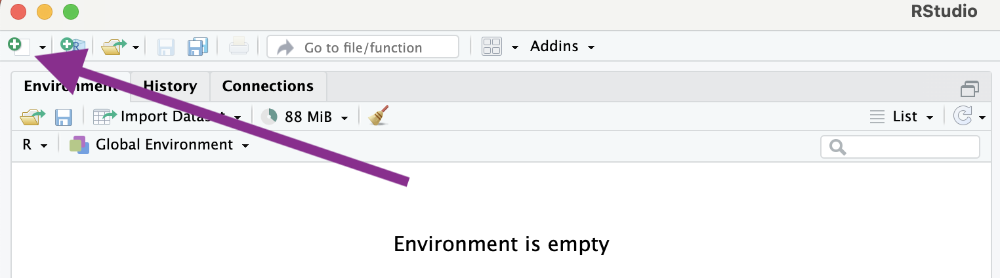
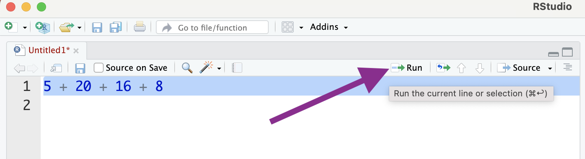
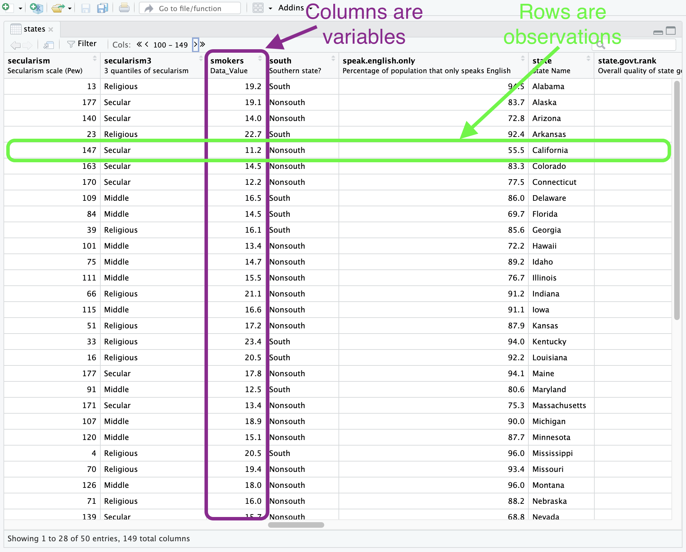




# Getting started with R and RStudio

[R](https://www.r-project.org/) is the stats software we'll be using in this course. [RStudio](https://posit.co/products/open-source/rstudio/) is a user-friendly interface for R that simplifies how you interact with R. Together, the software will allow you to manage data, conduct statistical analyses, create high-quality graphics, automate your research, and make your work reproducible, just to name a few features. 

If you haven't already, go ahead and [download R and RStudio](https://posit.co/download/rstudio-desktop/), and then install the software. The installation instructions are straightforward and, even better, the software is free to use. 

Once you've installed both programs you can launch RStudio like you would any other app. RStudio is able to directly interface with R so there's no need to launch the R app. 

Below is a screenshot of the RStudio interface with descriptive labels for each of the four panes. 

$~$

<div class="figure">

<p class="caption">The RStudio interface with labels</p>
</div>

$~$

Keep in mind that your interface could look a little different depending on the version you’re working with and any custom changes you make. You’ll become more familiar with why each feature is important, but for now here’s a quick rundown:

* Source. This is where your code files will live. We'll be using basic text files, called `.R` source files, that include a series of commands you want to run that we'll save for future use. In the most basic sense, commands tell R what you want it to do. When you're ready to run a command, you can do directly from the source pane.

* Console. This is where the code from your source file is sent and executed. After you issue a command, this is also where the output of the command will show up. The console is essentially what R looks like without RStudio. You can also interactively run commands here, which we'll cover later.

* Environments. Here you'll find a list of any dataframes you have loaded in R, along with other functions, vectors, plots, or tables you create. These are all listed in the environment tab and are collectively called objects. Don't worry to much about about the terminology for now, just remember that you'll find your data, plots, and tables listed here. 

* Output. There are several useful tabs in this pane. Here are the most important for now.
  + Files. Shows you all of the files in your current/working directory. The working directory is the location on your computer where R will look for files, like datasets. This is also the location where any files you save, like figures and tables, will end up. 
  + Plots. After you create figures you'll be able to view them here.
  + Help. You can view help files here after you use the `help()` command. 


## Let's run some code

The first thing we'll do to get started is open a new R script file. Here's where to create a new script:

$~$

<div class="figure">

<p class="caption">Start a new script file</p>
</div>

$~$

After you have the new untitled blank file, save it to your computer. Make sure you note where it's being saved so you can find it later. 

We'll start with a very basic command where we do some simple addition. Just type the following four numbers into your script: `5 + 20 + 16 + 8`. Then, select the line you want to execute and click on Run.

$~$

<div class="figure">

<p class="caption">Run your code</p>
</div>

$~$

Here's what the code should look like, along with the result.


``` r
5 + 20 + 16 + 8
```

```
## [1] 49
```


We can easily calculate the mean of these values by making some minor changes to the previous code.


``` r
(5 + 20 + 16 + 8) / 4
```

```
## [1] 12.25
```


We are clearly just using R as a fancy calculator at this point, but let's see how we can use some built in functions to accomplish the same tasks.

First, let's create a vector that includes the values we used above. I named the object `mynums`, which we can then use to access the list of numbers.


``` r
mynums <- c(5, 20, 16, 8)
mynums
```

```
## [1]  5 20 16  8
```

Now we can use `mynums` to sum the numbers and calculate the mean. There are also many other potentially useful functions we can use to get info about the `mynums` series.


``` r
# Addition.
sum(mynums)
```

```
## [1] 49
```

``` r
# Average.
mean(mynums)
```

```
## [1] 12.25
```

``` r
# Median.
median(mynums)
```

```
## [1] 12
```

``` r
# Minimum.
min(mynums)
```

```
## [1] 5
```

``` r
# Maximum.
max(mynums)
```

```
## [1] 20
```

``` r
# Standard deviation.
sd(mynums)
```

```
## [1] 6.946222
```

``` r
# Notice how R ignores everything after the '#' symbol.
```


In the above example, we use the built in functions `sum` and `mean` to easily get the sum and average of the list of numbers included in the `mynums` object we created earlier. We also included examples of some other commonly used functions. Head to this post on [Basic Functions in R](https://www.r-bloggers.com/2021/04/basic-functions-in-r/) for more details on functions in R.


## Using comments in your script file

You may have noticed the `#` symbol included in the script file commands that describe the purpose of each line of code. R will ignore anything your write after the `#`. This is how we can add comments to our script files, which will be very important once you start to work on larger projects. Consistently using comments in your code will help serve as a reference for why you did what you did in your script file. It will also help other researchers using your code to understand the logic behind your coding approach. 


## Now let's try with a dataset

In the above examples we used some very simple examples to get us started with running code and using functions in R. Of course, the series of numbers we used were just data we made up. Now, let's use some real data and start learning the basics of analysis with R. 

For most of this tutorial we'll be using data provided by the authors of the excellent [Essentials of Political Analysis](https://collegepublishing.sagepub.com/products/the-essentials-of-political-analysis-6-256992). The data are available as an R package. Packages are a very important part of R that give us many additional functions and tools created by other R users. In fact, one of the first things we'll do when starting a new script file is to download and load a handful of commonly used packages. 

The first time using a package you'll have to download it to your computer using the `install.packages()` command. Then, once the package is downloaded you'll use the `library()` command to load/attach it to your current R session.

Let's try with the data package we'll be working with, which is called `RCPA3`, as well as the `tidyverse` package. Tidyverse is actually a collection of several packages that we'll be using frequently. These tools will help make working with with your data much easier. The `tidyverse` package also includes `ggplot2`, which provides the functions we'll be using for data visualizations.


``` r
# Download the packages. 
# You should only have to do this once if you use the same computer.
install.packages("RCPA3")
install.packages("tidyverse")
```


``` r
# Load the packages.
library(RCPA3)
library(tidyverse)
```

```
## ── Attaching core tidyverse packages ──────────────────────── tidyverse 2.0.0 ──
## ✔ dplyr     1.1.4     ✔ readr     2.1.5
## ✔ forcats   1.0.0     ✔ stringr   1.5.1
## ✔ ggplot2   3.5.1     ✔ tibble    3.2.1
## ✔ lubridate 1.9.3     ✔ tidyr     1.3.1
## ✔ purrr     1.0.2     
## ── Conflicts ────────────────────────────────────────── tidyverse_conflicts() ──
## ✖ dplyr::filter() masks stats::filter()
## ✖ dplyr::lag()    masks stats::lag()
## ℹ Use the conflicted package (<http://conflicted.r-lib.org/>) to force all conflicts to become errors
```

Once the packages are loaded, we can take a look at the data. Here are a few functions you'll want to use when you get started with a new dataset. Let's take a look at the `states` data, which includes numerous variables for each of the 50 states.


``` r
# Get more info about a function. 
# In this case, it's info about the states data.
help("states")

# Get the names of the variables in the dataframe.
names(nes)

# Additional info about each variable.
glimpse(nes)
```


The above functions are useful when getting acquainted with the structure of the data. Notice that with the `glimpse()` function we are given the variable names, type, and example values of the variable. Also, the first lines of output from `glimpse` provides the number of rows and columns of the dataframe. This is equivalent to the number of *observations* (rows) and *variables* (columns) in the data.

It can also be helpful to use RStudio's built-in data viewer so you can browse the data like you would in the form of a spreadsheet.


``` r
# Browse the dataframe in RStudio's built-in viewer.
View(nes)
```


After using the `View()` function, you should have a new tab that includes the spreadsheet-style data viewer. It's important to note the structure of the dataframe. In the screenshot it's annotated to show that our data should always be organized so that our columns are variables and rows are our observations. This will be a particularly useful rule to follow if you are collecting or using data that are not already in R data format.


$~$

<div class="figure">

<p class="caption">Data viewer</p>
</div>

$~$


Now that we have some data to work with, let's do some basic data visualization. We'll start with a histogram, which provides an overview of a variable's distribution. The variable we'll plot is `vep20.turnout`, which is the state voter turnout rate in 2020.


``` r
# Histogram of voter turnout.
ggplot(states, mapping = aes(x = vep20.turnout)) +
  geom_histogram()
```

```
## `stat_bin()` using `bins = 30`. Pick better value with `binwidth`.
```

<!-- -->


Now let's plot a relationship. As an example, we might be interested in whether state voter turnout is related to state educational attainment. The `hs.or.more` variable is the percentage of those over 25 years of age who have earned at least a high school degree.


``` r
# Plot of the relationship between education and voter turnout.
# This is a scatterplot.
ggplot(states, mapping = aes(x = hs.or.more, y = vep20.turnout)) +
  geom_point() + geom_smooth(method = "lm")
```

```
## `geom_smooth()` using formula = 'y ~ x'
```

<!-- -->


In this figure we also included the `geom_smooth()` option. This gives the estimated linear relationship between voter turnout and education levels.


# Helpful links

1. [Quick-R](https://www.statmethods.net/r-tutorial/index.html)

1. [R for Data Science](https://r4ds.hadley.nz/)

1. [Introduction to ggplot2](https://ggplot2.tidyverse.org/articles/ggplot2.html)

1. Google. You are definitely not the only person looking for answers to questions you have about R. Many of these questions are asked on sites like Stack Overflow, Stack Exchange, Posit Community, and Reddit, where more experienced R users often give useful responses.


