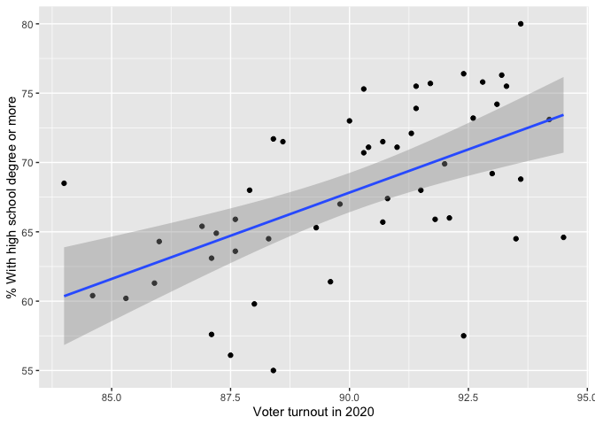
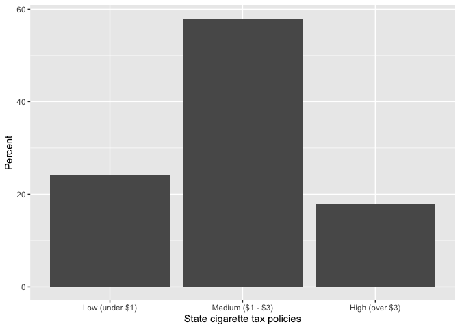

<style>
p.caption {
  font-size: 80%;
  font-style: italic;
  margin-bottom: 25px;
}
</style>





## Getting started with R and RStudio

[R](https://www.r-project.org/) is the stats software we'll be using in this course. [RStudio](https://posit.co/products/open-source/rstudio/) is a user-friendly interface for R that simplifies how you interact with R. Together, the software will allow you to manage data, conduct statistical analyses, create high-quality graphics, automate your research, and make your work reproducible, just to name a few features. 

If you haven't already, go ahead and [download R and RStudio](https://posit.co/download/rstudio-desktop/), and then install the software. The installation instructions are straightforward and, even better, the software is free to use. 

Once you've installed both programs you can launch RStudio like you would any other app. RStudio is able to directly interface with R so there's no need to launch the R app. 

Below is a screenshot of the RStudio interface with descriptive labels for each of the four panes. 


<div class="figure">

<p class="caption">The RStudio interface with labels</p>
</div>


Keep in mind that your interface could look a little different depending on the version you’re working with and any custom changes you make. You’ll become more familiar with why each feature is important, but for now here’s a quick rundown:

* Source. This is where your code files will live. We'll be using basic text files, called `.R` source files, that include a series of commands you want to run that we'll save for future use. In the most basic sense, commands tell R what you want it to do. When you're ready to run a command, you can do directly from the source pane.

* Console. This is where the code from your source file is sent and executed. After you issue a command, this is also where the output of the command will show up. The console is essentially what R looks like without RStudio. You can also interactively run commands here, which we'll cover later.

* Environments. Here you'll find a list of any dataframes you have loaded in R, along with other functions, vectors, plots, or tables you create. These are all listed in the environment tab and are collectively called objects. Don't worry to much about about the terminology for now, just remember that you'll find your data, plots, and tables listed here. 

* Output. There are several useful tabs in this pane. Here are the most important for now.
  + Files. Shows you all of the files in your current/working directory. The working directory is the location on your computer where R will look for files, like datasets. This is also the location where any files you save, like figures and tables, will end up. 
  + Plots. After you create figures you'll be able to view them here.
  + Help. You can view help files here after you use the `help()` command. 


### Let's run some code

The first thing we'll do to get started is open a new R script file. Here's where to create a new script:


<div class="figure">

<p class="caption">Start a new script file</p>
</div>


After you have the new untitled blank file, save it to your computer. Make sure you note where it's being saved so you can find it later. 

We'll start with a very basic command where we do some simple addition. Just type the following four numbers into your script: `5 + 20 + 16 + 8`. Then, select the line you want to execute and click on Run.


<div class="figure">

<p class="caption">Run your code</p>
</div>


Here's what the code should look like, along with the result.


``` r
5 + 20 + 16 + 8
```

```
## [1] 49
```


We can easily calculate the mean of these values by making some minor changes to the previous code.


``` r
(5 + 20 + 16 + 8) / 4
```

```
## [1] 12.25
```


We are clearly just using R as a fancy calculator at this point, but let's see how we can use some built in functions to accomplish the same tasks.

First, let's create a vector that includes the values we used above. I named the object `mynums`, which we can then use to access the list of numbers.


``` r
mynums <- c(5, 20, 16, 8)
mynums
```

```
## [1]  5 20 16  8
```

Now we can use `mynums` to sum the numbers and calculate the mean. There are also many other potentially useful functions we can use to get info about the `mynums` series.


``` r
# Addition.
sum(mynums)
```

```
## [1] 49
```

``` r
# Average.
mean(mynums)
```

```
## [1] 12.25
```

``` r
# Median.
median(mynums)
```

```
## [1] 12
```

``` r
# Minimum.
min(mynums)
```

```
## [1] 5
```

``` r
# Maximum.
max(mynums)
```

```
## [1] 20
```

``` r
# Standard deviation.
sd(mynums)
```

```
## [1] 6.946222
```

``` r
# Notice how R ignores everything after the '#' symbol.
```


In the above example, we use the built in functions `sum` and `mean` to easily get the sum and average of the list of numbers included in the `mynums` object we created earlier. We also included examples of some other commonly used functions. Head to this post on [Basic Functions in R](https://www.r-bloggers.com/2021/04/basic-functions-in-r/) for more details on functions in R.


### Using comments in your script file

You may have noticed the `#` symbol included in the script file commands that describe the purpose of each line of code. R will ignore anything your write after the `#`. This is how we can add comments to our script files, which will be very important once you start to work on larger projects. Consistently using comments in your code will help serve as a reference for why you did what you did in your script file. It will also help other researchers using your code to understand the logic behind your coding approach. 


### Now let's try with a dataset

In the above examples we used some very simple examples to get us started with running code and using functions in R. Of course, the series of numbers we used were just data we made up. Now, let's use some real data and start learning the basics of analysis with R. 

For most of this tutorial we'll be using data provided by the authors of the excellent [Essentials of Political Analysis](https://collegepublishing.sagepub.com/products/the-essentials-of-political-analysis-6-256992). The data are available as an R package called `RCPA3`. Packages are a very important part of R that give us many additional functions and tools created by other R users. In fact, one of the first things we'll do when starting a new script file is to download and load a handful of commonly used packages. 

The first time using a package you'll have to download it to your computer using the `install.packages()` command. Then, once the package is downloaded you'll use the `library()` command to load/attach it to your current R session.

In addition to using the datasets from the `RCPA3` package, we'll also being using the `tidyverse` package. Tidyverse is actually a collection of several packages that we'll use frequently. These tools will help make working with with your data much easier. This is particularly true when transforming and managing your data. Data transformation is the focus of later sections in this tutorial where we'll talk more about the tidy approach to data processing. The `tidyverse` package also includes `ggplot2`, which provides the functions we'll be using for data visualizations.


``` r
# Download the packages. 
# You should only have to do this once if you use the same computer.
install.packages("RCPA3")
install.packages("tidyverse")
```


``` r
# Load the packages.
library(RCPA3)
library(tidyverse)
```

```
## ── Attaching core tidyverse packages ──────────────────────── tidyverse 2.0.0 ──
## ✔ dplyr     1.1.4     ✔ readr     2.1.5
## ✔ forcats   1.0.0     ✔ stringr   1.5.1
## ✔ ggplot2   3.5.1     ✔ tibble    3.2.1
## ✔ lubridate 1.9.3     ✔ tidyr     1.3.1
## ✔ purrr     1.0.2     
## ── Conflicts ────────────────────────────────────────── tidyverse_conflicts() ──
## ✖ dplyr::filter() masks stats::filter()
## ✖ dplyr::lag()    masks stats::lag()
## ℹ Use the conflicted package (<http://conflicted.r-lib.org/>) to force all conflicts to become errors
```

Once the packages are loaded, we can take a look at the data. Here are a few functions you'll want to use when you get started with a new dataset. Let's take a look at the `states` data, which includes numerous variables for each of the 50 states.


``` r
# Get more info about a function. 
# In this case, it's info about the states data.
help("states")

# Get the names of the variables in the dataframe.
names(states)

# Additional info about the variables in the dataframe.
glimpse(states)
```


The above functions are useful when getting acquainted with the structure of the data. Notice that with the `glimpse()` function we are given the variable names, type, and example values of the variable. Also, the first lines of output from `glimpse` provides the number of rows and columns of the dataframe. This is equivalent to the number of *observations* (rows) and *variables* (columns) in the data.

It can also be helpful to use RStudio's built-in data viewer so you can browse the data like you would in the form of a spreadsheet.


``` r
# Browse the dataframe in RStudio's built-in viewer.
View(states)
```


After using the `View()` function, you should have a new tab that includes the spreadsheet-style data viewer. It's important to note the structure of the dataframe. In the screenshot it's annotated to show that our data should always be organized so that our columns are variables and rows are our observations. This will be a particularly useful rule to follow if you are collecting or using data that are not already in R data format. This structure is also an essential requirement for keeping your data in tidy format. In other words, as long as you make sure your columns are variables and rows are observations, your data will be compatable with the tidyverse tools we'll be using.


<div class="figure">

<p class="caption">Data viewer</p>
</div>


Now that we have some data to work with, let's do some basic data visualization. We'll start with a histogram, which provides an overview of a variable's distribution. The variable we'll plot is `vep20.turnout`, which is the state voter turnout rate in 2020.


``` r
# Histogram of voter turnout.
# First line includes data and variable to plot.
# Second line plots using the histogram.
fig.hist <- ggplot(states, mapping = aes(x = vep20.turnout)) +
  geom_histogram()
fig.hist # Run the object we created to show the plot.
```

```
## `stat_bin()` using `bins = 30`. Pick better value with `binwidth`.
```

<!-- -->


It's also easy to add labels to the figure. The code below adds a third line to the histogram code we used so that the plot now includes an x-axis label and title.


``` r
# Histogram of voter turnout, now with labels.
fig.hist <- ggplot(states, mapping = aes(x = vep20.turnout)) +
  geom_histogram() +
  labs(x = "Voter turnout in 2020",
       title = "Histogram of 2020 voter turnout")
fig.hist 
```

```
## `stat_bin()` using `bins = 30`. Pick better value with `binwidth`.
```

<!-- -->


Now let's plot a relationship. As an example, we might be interested in whether state voter turnout is related to state educational attainment. The `hs.or.more` variable is the percentage of those over 25 years of age who have earned at least a high school degree.


``` r
# Plot of the relationship between education and voter turnout.
# This is a scatterplot.
fig.scat <- ggplot(states, mapping = aes(x = hs.or.more, y = vep20.turnout)) +
  geom_point() + 
  geom_smooth(method = "lm") +
  labs(x = "Voter turnout in 2020",
       y = "% With high school degree or more")
fig.scat
```

```
## `geom_smooth()` using formula = 'y ~ x'
```

<!-- -->


In this figure we also included the `geom_smooth()` option. This gives the estimated linear relationship between voter turnout and education levels.


## Describing variables

It’s typically a good idea to learn about the basic characteristics of the variables in a dataset, particularly when you’re using secondary data. This can be done by obtaining the descriptive statistics for the variables you plan on using, which includes measures of central tendency (e.g., mean, median, and mode) and dispersion (e.g., variance and standard deviation).

The method you use to describe a variable will depend on the variable’s level of measurement. Remember, the only measure of central tendency that is appropriate for a nominal variable is the mode, which we define as the most frequently occurring value. For ordinal variables, we can use the mode or the median. The mode, median, and mean can all be used for continuous variables. In fact, it’s probably wise to look at all of them since together the three measures can tell us about the symmetry of the variable’s distribution.

In the previous section we used the `glimpse()` command to get basic information about the variables in the `states` dataset, which includes the variable type. Variable types in R datasets can include numeric, integer, character, and factor. The variable type will not always correspond to the variable metric, but it can help with identifying the metric and is important to know when analyzing your data. It's also important to keep in mind that a variable can be stored as a variable type that isn't ideal for your analysis. When this happens we have to change the type, which will be covered in the data transformation section. 

The `gtsummary` package is very useful for putting together descriptive statistics, particularly for continuous level variables. It let's us customize the what we include in the descriptive statistics and the package makes it fairly easy to save the tables we create (for example, in ms word format). We'll also need to create some tabulations of our nominal and ordinal level variables. For tabulations we'll use the `questionr` package. 

Let's give it a try. Similar to the other packages we've used, you'll have to install `gtsummary` and `questionr` the first time you use them We'll also be using the `RCPA3` and `tidyverse` packages. 


``` r
# First install packages if you haven't already.
#install.packages("gtsummary")
#install.packages("questionr")

# Load the packages.
library(gtsummary)
library(questionr)
```

```
## 
## Attaching package: 'questionr'
```

```
## The following objects are masked from 'package:RCPA3':
## 
##     describe, freq, wtd.mean, wtd.var
```

``` r
library(RCPA3)
library(tidyverse)

states %>% # Dataset we want to use.
  select(vep20.turnout, region, cig.tax.3cat) %>% # Select variables we want stats for.
  tbl_summary(missing = "no") # Get the descriptive statistics.
```

```{=html}
<div id="jjwfvrtlkv" style="padding-left:0px;padding-right:0px;padding-top:10px;padding-bottom:10px;overflow-x:auto;overflow-y:auto;width:auto;height:auto;">
<style>#jjwfvrtlkv table {
  font-family: system-ui, 'Segoe UI', Roboto, Helvetica, Arial, sans-serif, 'Apple Color Emoji', 'Segoe UI Emoji', 'Segoe UI Symbol', 'Noto Color Emoji';
  -webkit-font-smoothing: antialiased;
  -moz-osx-font-smoothing: grayscale;
}

#jjwfvrtlkv thead, #jjwfvrtlkv tbody, #jjwfvrtlkv tfoot, #jjwfvrtlkv tr, #jjwfvrtlkv td, #jjwfvrtlkv th {
  border-style: none;
}

#jjwfvrtlkv p {
  margin: 0;
  padding: 0;
}

#jjwfvrtlkv .gt_table {
  display: table;
  border-collapse: collapse;
  line-height: normal;
  margin-left: auto;
  margin-right: auto;
  color: #333333;
  font-size: 16px;
  font-weight: normal;
  font-style: normal;
  background-color: #FFFFFF;
  width: auto;
  border-top-style: solid;
  border-top-width: 2px;
  border-top-color: #A8A8A8;
  border-right-style: none;
  border-right-width: 2px;
  border-right-color: #D3D3D3;
  border-bottom-style: solid;
  border-bottom-width: 2px;
  border-bottom-color: #A8A8A8;
  border-left-style: none;
  border-left-width: 2px;
  border-left-color: #D3D3D3;
}

#jjwfvrtlkv .gt_caption {
  padding-top: 4px;
  padding-bottom: 4px;
}

#jjwfvrtlkv .gt_title {
  color: #333333;
  font-size: 125%;
  font-weight: initial;
  padding-top: 4px;
  padding-bottom: 4px;
  padding-left: 5px;
  padding-right: 5px;
  border-bottom-color: #FFFFFF;
  border-bottom-width: 0;
}

#jjwfvrtlkv .gt_subtitle {
  color: #333333;
  font-size: 85%;
  font-weight: initial;
  padding-top: 3px;
  padding-bottom: 5px;
  padding-left: 5px;
  padding-right: 5px;
  border-top-color: #FFFFFF;
  border-top-width: 0;
}

#jjwfvrtlkv .gt_heading {
  background-color: #FFFFFF;
  text-align: center;
  border-bottom-color: #FFFFFF;
  border-left-style: none;
  border-left-width: 1px;
  border-left-color: #D3D3D3;
  border-right-style: none;
  border-right-width: 1px;
  border-right-color: #D3D3D3;
}

#jjwfvrtlkv .gt_bottom_border {
  border-bottom-style: solid;
  border-bottom-width: 2px;
  border-bottom-color: #D3D3D3;
}

#jjwfvrtlkv .gt_col_headings {
  border-top-style: solid;
  border-top-width: 2px;
  border-top-color: #D3D3D3;
  border-bottom-style: solid;
  border-bottom-width: 2px;
  border-bottom-color: #D3D3D3;
  border-left-style: none;
  border-left-width: 1px;
  border-left-color: #D3D3D3;
  border-right-style: none;
  border-right-width: 1px;
  border-right-color: #D3D3D3;
}

#jjwfvrtlkv .gt_col_heading {
  color: #333333;
  background-color: #FFFFFF;
  font-size: 100%;
  font-weight: normal;
  text-transform: inherit;
  border-left-style: none;
  border-left-width: 1px;
  border-left-color: #D3D3D3;
  border-right-style: none;
  border-right-width: 1px;
  border-right-color: #D3D3D3;
  vertical-align: bottom;
  padding-top: 5px;
  padding-bottom: 6px;
  padding-left: 5px;
  padding-right: 5px;
  overflow-x: hidden;
}

#jjwfvrtlkv .gt_column_spanner_outer {
  color: #333333;
  background-color: #FFFFFF;
  font-size: 100%;
  font-weight: normal;
  text-transform: inherit;
  padding-top: 0;
  padding-bottom: 0;
  padding-left: 4px;
  padding-right: 4px;
}

#jjwfvrtlkv .gt_column_spanner_outer:first-child {
  padding-left: 0;
}

#jjwfvrtlkv .gt_column_spanner_outer:last-child {
  padding-right: 0;
}

#jjwfvrtlkv .gt_column_spanner {
  border-bottom-style: solid;
  border-bottom-width: 2px;
  border-bottom-color: #D3D3D3;
  vertical-align: bottom;
  padding-top: 5px;
  padding-bottom: 5px;
  overflow-x: hidden;
  display: inline-block;
  width: 100%;
}

#jjwfvrtlkv .gt_spanner_row {
  border-bottom-style: hidden;
}

#jjwfvrtlkv .gt_group_heading {
  padding-top: 8px;
  padding-bottom: 8px;
  padding-left: 5px;
  padding-right: 5px;
  color: #333333;
  background-color: #FFFFFF;
  font-size: 100%;
  font-weight: initial;
  text-transform: inherit;
  border-top-style: solid;
  border-top-width: 2px;
  border-top-color: #D3D3D3;
  border-bottom-style: solid;
  border-bottom-width: 2px;
  border-bottom-color: #D3D3D3;
  border-left-style: none;
  border-left-width: 1px;
  border-left-color: #D3D3D3;
  border-right-style: none;
  border-right-width: 1px;
  border-right-color: #D3D3D3;
  vertical-align: middle;
  text-align: left;
}

#jjwfvrtlkv .gt_empty_group_heading {
  padding: 0.5px;
  color: #333333;
  background-color: #FFFFFF;
  font-size: 100%;
  font-weight: initial;
  border-top-style: solid;
  border-top-width: 2px;
  border-top-color: #D3D3D3;
  border-bottom-style: solid;
  border-bottom-width: 2px;
  border-bottom-color: #D3D3D3;
  vertical-align: middle;
}

#jjwfvrtlkv .gt_from_md > :first-child {
  margin-top: 0;
}

#jjwfvrtlkv .gt_from_md > :last-child {
  margin-bottom: 0;
}

#jjwfvrtlkv .gt_row {
  padding-top: 8px;
  padding-bottom: 8px;
  padding-left: 5px;
  padding-right: 5px;
  margin: 10px;
  border-top-style: solid;
  border-top-width: 1px;
  border-top-color: #D3D3D3;
  border-left-style: none;
  border-left-width: 1px;
  border-left-color: #D3D3D3;
  border-right-style: none;
  border-right-width: 1px;
  border-right-color: #D3D3D3;
  vertical-align: middle;
  overflow-x: hidden;
}

#jjwfvrtlkv .gt_stub {
  color: #333333;
  background-color: #FFFFFF;
  font-size: 100%;
  font-weight: initial;
  text-transform: inherit;
  border-right-style: solid;
  border-right-width: 2px;
  border-right-color: #D3D3D3;
  padding-left: 5px;
  padding-right: 5px;
}

#jjwfvrtlkv .gt_stub_row_group {
  color: #333333;
  background-color: #FFFFFF;
  font-size: 100%;
  font-weight: initial;
  text-transform: inherit;
  border-right-style: solid;
  border-right-width: 2px;
  border-right-color: #D3D3D3;
  padding-left: 5px;
  padding-right: 5px;
  vertical-align: top;
}

#jjwfvrtlkv .gt_row_group_first td {
  border-top-width: 2px;
}

#jjwfvrtlkv .gt_row_group_first th {
  border-top-width: 2px;
}

#jjwfvrtlkv .gt_summary_row {
  color: #333333;
  background-color: #FFFFFF;
  text-transform: inherit;
  padding-top: 8px;
  padding-bottom: 8px;
  padding-left: 5px;
  padding-right: 5px;
}

#jjwfvrtlkv .gt_first_summary_row {
  border-top-style: solid;
  border-top-color: #D3D3D3;
}

#jjwfvrtlkv .gt_first_summary_row.thick {
  border-top-width: 2px;
}

#jjwfvrtlkv .gt_last_summary_row {
  padding-top: 8px;
  padding-bottom: 8px;
  padding-left: 5px;
  padding-right: 5px;
  border-bottom-style: solid;
  border-bottom-width: 2px;
  border-bottom-color: #D3D3D3;
}

#jjwfvrtlkv .gt_grand_summary_row {
  color: #333333;
  background-color: #FFFFFF;
  text-transform: inherit;
  padding-top: 8px;
  padding-bottom: 8px;
  padding-left: 5px;
  padding-right: 5px;
}

#jjwfvrtlkv .gt_first_grand_summary_row {
  padding-top: 8px;
  padding-bottom: 8px;
  padding-left: 5px;
  padding-right: 5px;
  border-top-style: double;
  border-top-width: 6px;
  border-top-color: #D3D3D3;
}

#jjwfvrtlkv .gt_last_grand_summary_row_top {
  padding-top: 8px;
  padding-bottom: 8px;
  padding-left: 5px;
  padding-right: 5px;
  border-bottom-style: double;
  border-bottom-width: 6px;
  border-bottom-color: #D3D3D3;
}

#jjwfvrtlkv .gt_striped {
  background-color: rgba(128, 128, 128, 0.05);
}

#jjwfvrtlkv .gt_table_body {
  border-top-style: solid;
  border-top-width: 2px;
  border-top-color: #D3D3D3;
  border-bottom-style: solid;
  border-bottom-width: 2px;
  border-bottom-color: #D3D3D3;
}

#jjwfvrtlkv .gt_footnotes {
  color: #333333;
  background-color: #FFFFFF;
  border-bottom-style: none;
  border-bottom-width: 2px;
  border-bottom-color: #D3D3D3;
  border-left-style: none;
  border-left-width: 2px;
  border-left-color: #D3D3D3;
  border-right-style: none;
  border-right-width: 2px;
  border-right-color: #D3D3D3;
}

#jjwfvrtlkv .gt_footnote {
  margin: 0px;
  font-size: 90%;
  padding-top: 4px;
  padding-bottom: 4px;
  padding-left: 5px;
  padding-right: 5px;
}

#jjwfvrtlkv .gt_sourcenotes {
  color: #333333;
  background-color: #FFFFFF;
  border-bottom-style: none;
  border-bottom-width: 2px;
  border-bottom-color: #D3D3D3;
  border-left-style: none;
  border-left-width: 2px;
  border-left-color: #D3D3D3;
  border-right-style: none;
  border-right-width: 2px;
  border-right-color: #D3D3D3;
}

#jjwfvrtlkv .gt_sourcenote {
  font-size: 90%;
  padding-top: 4px;
  padding-bottom: 4px;
  padding-left: 5px;
  padding-right: 5px;
}

#jjwfvrtlkv .gt_left {
  text-align: left;
}

#jjwfvrtlkv .gt_center {
  text-align: center;
}

#jjwfvrtlkv .gt_right {
  text-align: right;
  font-variant-numeric: tabular-nums;
}

#jjwfvrtlkv .gt_font_normal {
  font-weight: normal;
}

#jjwfvrtlkv .gt_font_bold {
  font-weight: bold;
}

#jjwfvrtlkv .gt_font_italic {
  font-style: italic;
}

#jjwfvrtlkv .gt_super {
  font-size: 65%;
}

#jjwfvrtlkv .gt_footnote_marks {
  font-size: 75%;
  vertical-align: 0.4em;
  position: initial;
}

#jjwfvrtlkv .gt_asterisk {
  font-size: 100%;
  vertical-align: 0;
}

#jjwfvrtlkv .gt_indent_1 {
  text-indent: 5px;
}

#jjwfvrtlkv .gt_indent_2 {
  text-indent: 10px;
}

#jjwfvrtlkv .gt_indent_3 {
  text-indent: 15px;
}

#jjwfvrtlkv .gt_indent_4 {
  text-indent: 20px;
}

#jjwfvrtlkv .gt_indent_5 {
  text-indent: 25px;
}

#jjwfvrtlkv .katex-display {
  display: inline-flex !important;
  margin-bottom: 0.75em !important;
}

#jjwfvrtlkv div.Reactable > div.rt-table > div.rt-thead > div.rt-tr.rt-tr-group-header > div.rt-th-group:after {
  height: 0px !important;
}
</style>
<table class="gt_table" data-quarto-disable-processing="false" data-quarto-bootstrap="false">
  <thead>
    <tr class="gt_col_headings">
      <th class="gt_col_heading gt_columns_bottom_border gt_left" rowspan="1" colspan="1" scope="col" id="&lt;span class='gt_from_md'&gt;&lt;strong&gt;Characteristic&lt;/strong&gt;&lt;/span&gt;"><span class='gt_from_md'><strong>Characteristic</strong></span></th>
      <th class="gt_col_heading gt_columns_bottom_border gt_center" rowspan="1" colspan="1" scope="col" id="&lt;span class='gt_from_md'&gt;&lt;strong&gt;N = 50&lt;/strong&gt;&lt;/span&gt;&lt;span class=&quot;gt_footnote_marks&quot; style=&quot;white-space:nowrap;font-style:italic;font-weight:normal;line-height: 0;&quot;&gt;&lt;sup&gt;1&lt;/sup&gt;&lt;/span&gt;"><span class='gt_from_md'><strong>N = 50</strong></span><span class="gt_footnote_marks" style="white-space:nowrap;font-style:italic;font-weight:normal;line-height: 0;"><sup>1</sup></span></th>
    </tr>
  </thead>
  <tbody class="gt_table_body">
    <tr><td headers="label" class="gt_row gt_left">Percent turnout of voting eligible population in 2020</td>
<td headers="stat_0" class="gt_row gt_center">68.0 (64.5, 72.8)</td></tr>
    <tr><td headers="label" class="gt_row gt_left">Census region</td>
<td headers="stat_0" class="gt_row gt_center"><br /></td></tr>
    <tr><td headers="label" class="gt_row gt_left">    Northeast</td>
<td headers="stat_0" class="gt_row gt_center">9 (18%)</td></tr>
    <tr><td headers="label" class="gt_row gt_left">    Midwest</td>
<td headers="stat_0" class="gt_row gt_center">12 (24%)</td></tr>
    <tr><td headers="label" class="gt_row gt_left">    South</td>
<td headers="stat_0" class="gt_row gt_center">16 (32%)</td></tr>
    <tr><td headers="label" class="gt_row gt_left">    West</td>
<td headers="stat_0" class="gt_row gt_center">13 (26%)</td></tr>
    <tr><td headers="label" class="gt_row gt_left">Cigarette tax per pack, 3 ordinal categories</td>
<td headers="stat_0" class="gt_row gt_center"><br /></td></tr>
    <tr><td headers="label" class="gt_row gt_left">    Low (under $1)</td>
<td headers="stat_0" class="gt_row gt_center">12 (24%)</td></tr>
    <tr><td headers="label" class="gt_row gt_left">    Medium ($1 - $3)</td>
<td headers="stat_0" class="gt_row gt_center">29 (58%)</td></tr>
    <tr><td headers="label" class="gt_row gt_left">    High (over $3)</td>
<td headers="stat_0" class="gt_row gt_center">9 (18%)</td></tr>
  </tbody>
  
  <tfoot class="gt_footnotes">
    <tr>
      <td class="gt_footnote" colspan="2"><span class="gt_footnote_marks" style="white-space:nowrap;font-style:italic;font-weight:normal;line-height: 0;"><sup>1</sup></span> <span class='gt_from_md'>Median (IQR); n (%)</span></td>
    </tr>
  </tfoot>
</table>
</div>
```

A quick note on this code. This is the first time we are using `%>%`, which is called a pipe operator in tidy data language. The idea is that it allows you to "pipe" an object forward to one or more additional functions. In the command above we start with the `states` dataset, then use `select()` to choose the variables from the `states` dataset we want to work with, and finally use the `tbl_summary()` to get our descriptive statistics. 

The first thing you might notice about the output is that the `tbl_summary()` function creates a nicely formatted table by default and diplays it for you in the viewer pane. It also gives the variable labels so we have more information than just the variable names. In our table we are getting descriptive statistics for voter turnout in the states, state region, and data on cigarette tax policies.

By default, `tbl_summary()` gives us different statistics depending on the variable measurement metric. The footnote of the table tells us that for continuous variables it is giving us the median and IQR, or interquartile range. IQR is just a fancy way of saying the 25th and 75th percentiles. For all other non-continuous variables we get the number of observations in each variable group along with the percentage. In this example, `vep20.turnout` is the only continuous variable while `region` and `cig.tax.3cat` are non-continuous. Both are considered categorical by `tbl_summary()` even though `region` is nominal and `cig.tax.3cat` is categorical. Below we'll address why we might want different descriptive statistics for these different levels of measurement.

These default statistics are a good start, but it would be nice to have some additional information. For example, we'll probably want the mean, variance, and standard deviation of our continuous variables. Here's how we can get everything we need. 


``` r
states %>%
  select(vep20.turnout, region, cig.tax.3cat) %>%
  tbl_summary(
    statistic = list(
      all_continuous() ~ "{mean}, {median}, {var}, {sd} /
      [{p25}, {p75}] / [{min}, {max}]",
      all_categorical() ~ "{p}% ({n})"
    ),
    missing = "no",
    ) %>%
  add_stat_label(location = "column")
```

```{=html}
<div id="sbhierkoob" style="padding-left:0px;padding-right:0px;padding-top:10px;padding-bottom:10px;overflow-x:auto;overflow-y:auto;width:auto;height:auto;">
<style>#sbhierkoob table {
  font-family: system-ui, 'Segoe UI', Roboto, Helvetica, Arial, sans-serif, 'Apple Color Emoji', 'Segoe UI Emoji', 'Segoe UI Symbol', 'Noto Color Emoji';
  -webkit-font-smoothing: antialiased;
  -moz-osx-font-smoothing: grayscale;
}

#sbhierkoob thead, #sbhierkoob tbody, #sbhierkoob tfoot, #sbhierkoob tr, #sbhierkoob td, #sbhierkoob th {
  border-style: none;
}

#sbhierkoob p {
  margin: 0;
  padding: 0;
}

#sbhierkoob .gt_table {
  display: table;
  border-collapse: collapse;
  line-height: normal;
  margin-left: auto;
  margin-right: auto;
  color: #333333;
  font-size: 16px;
  font-weight: normal;
  font-style: normal;
  background-color: #FFFFFF;
  width: auto;
  border-top-style: solid;
  border-top-width: 2px;
  border-top-color: #A8A8A8;
  border-right-style: none;
  border-right-width: 2px;
  border-right-color: #D3D3D3;
  border-bottom-style: solid;
  border-bottom-width: 2px;
  border-bottom-color: #A8A8A8;
  border-left-style: none;
  border-left-width: 2px;
  border-left-color: #D3D3D3;
}

#sbhierkoob .gt_caption {
  padding-top: 4px;
  padding-bottom: 4px;
}

#sbhierkoob .gt_title {
  color: #333333;
  font-size: 125%;
  font-weight: initial;
  padding-top: 4px;
  padding-bottom: 4px;
  padding-left: 5px;
  padding-right: 5px;
  border-bottom-color: #FFFFFF;
  border-bottom-width: 0;
}

#sbhierkoob .gt_subtitle {
  color: #333333;
  font-size: 85%;
  font-weight: initial;
  padding-top: 3px;
  padding-bottom: 5px;
  padding-left: 5px;
  padding-right: 5px;
  border-top-color: #FFFFFF;
  border-top-width: 0;
}

#sbhierkoob .gt_heading {
  background-color: #FFFFFF;
  text-align: center;
  border-bottom-color: #FFFFFF;
  border-left-style: none;
  border-left-width: 1px;
  border-left-color: #D3D3D3;
  border-right-style: none;
  border-right-width: 1px;
  border-right-color: #D3D3D3;
}

#sbhierkoob .gt_bottom_border {
  border-bottom-style: solid;
  border-bottom-width: 2px;
  border-bottom-color: #D3D3D3;
}

#sbhierkoob .gt_col_headings {
  border-top-style: solid;
  border-top-width: 2px;
  border-top-color: #D3D3D3;
  border-bottom-style: solid;
  border-bottom-width: 2px;
  border-bottom-color: #D3D3D3;
  border-left-style: none;
  border-left-width: 1px;
  border-left-color: #D3D3D3;
  border-right-style: none;
  border-right-width: 1px;
  border-right-color: #D3D3D3;
}

#sbhierkoob .gt_col_heading {
  color: #333333;
  background-color: #FFFFFF;
  font-size: 100%;
  font-weight: normal;
  text-transform: inherit;
  border-left-style: none;
  border-left-width: 1px;
  border-left-color: #D3D3D3;
  border-right-style: none;
  border-right-width: 1px;
  border-right-color: #D3D3D3;
  vertical-align: bottom;
  padding-top: 5px;
  padding-bottom: 6px;
  padding-left: 5px;
  padding-right: 5px;
  overflow-x: hidden;
}

#sbhierkoob .gt_column_spanner_outer {
  color: #333333;
  background-color: #FFFFFF;
  font-size: 100%;
  font-weight: normal;
  text-transform: inherit;
  padding-top: 0;
  padding-bottom: 0;
  padding-left: 4px;
  padding-right: 4px;
}

#sbhierkoob .gt_column_spanner_outer:first-child {
  padding-left: 0;
}

#sbhierkoob .gt_column_spanner_outer:last-child {
  padding-right: 0;
}

#sbhierkoob .gt_column_spanner {
  border-bottom-style: solid;
  border-bottom-width: 2px;
  border-bottom-color: #D3D3D3;
  vertical-align: bottom;
  padding-top: 5px;
  padding-bottom: 5px;
  overflow-x: hidden;
  display: inline-block;
  width: 100%;
}

#sbhierkoob .gt_spanner_row {
  border-bottom-style: hidden;
}

#sbhierkoob .gt_group_heading {
  padding-top: 8px;
  padding-bottom: 8px;
  padding-left: 5px;
  padding-right: 5px;
  color: #333333;
  background-color: #FFFFFF;
  font-size: 100%;
  font-weight: initial;
  text-transform: inherit;
  border-top-style: solid;
  border-top-width: 2px;
  border-top-color: #D3D3D3;
  border-bottom-style: solid;
  border-bottom-width: 2px;
  border-bottom-color: #D3D3D3;
  border-left-style: none;
  border-left-width: 1px;
  border-left-color: #D3D3D3;
  border-right-style: none;
  border-right-width: 1px;
  border-right-color: #D3D3D3;
  vertical-align: middle;
  text-align: left;
}

#sbhierkoob .gt_empty_group_heading {
  padding: 0.5px;
  color: #333333;
  background-color: #FFFFFF;
  font-size: 100%;
  font-weight: initial;
  border-top-style: solid;
  border-top-width: 2px;
  border-top-color: #D3D3D3;
  border-bottom-style: solid;
  border-bottom-width: 2px;
  border-bottom-color: #D3D3D3;
  vertical-align: middle;
}

#sbhierkoob .gt_from_md > :first-child {
  margin-top: 0;
}

#sbhierkoob .gt_from_md > :last-child {
  margin-bottom: 0;
}

#sbhierkoob .gt_row {
  padding-top: 8px;
  padding-bottom: 8px;
  padding-left: 5px;
  padding-right: 5px;
  margin: 10px;
  border-top-style: solid;
  border-top-width: 1px;
  border-top-color: #D3D3D3;
  border-left-style: none;
  border-left-width: 1px;
  border-left-color: #D3D3D3;
  border-right-style: none;
  border-right-width: 1px;
  border-right-color: #D3D3D3;
  vertical-align: middle;
  overflow-x: hidden;
}

#sbhierkoob .gt_stub {
  color: #333333;
  background-color: #FFFFFF;
  font-size: 100%;
  font-weight: initial;
  text-transform: inherit;
  border-right-style: solid;
  border-right-width: 2px;
  border-right-color: #D3D3D3;
  padding-left: 5px;
  padding-right: 5px;
}

#sbhierkoob .gt_stub_row_group {
  color: #333333;
  background-color: #FFFFFF;
  font-size: 100%;
  font-weight: initial;
  text-transform: inherit;
  border-right-style: solid;
  border-right-width: 2px;
  border-right-color: #D3D3D3;
  padding-left: 5px;
  padding-right: 5px;
  vertical-align: top;
}

#sbhierkoob .gt_row_group_first td {
  border-top-width: 2px;
}

#sbhierkoob .gt_row_group_first th {
  border-top-width: 2px;
}

#sbhierkoob .gt_summary_row {
  color: #333333;
  background-color: #FFFFFF;
  text-transform: inherit;
  padding-top: 8px;
  padding-bottom: 8px;
  padding-left: 5px;
  padding-right: 5px;
}

#sbhierkoob .gt_first_summary_row {
  border-top-style: solid;
  border-top-color: #D3D3D3;
}

#sbhierkoob .gt_first_summary_row.thick {
  border-top-width: 2px;
}

#sbhierkoob .gt_last_summary_row {
  padding-top: 8px;
  padding-bottom: 8px;
  padding-left: 5px;
  padding-right: 5px;
  border-bottom-style: solid;
  border-bottom-width: 2px;
  border-bottom-color: #D3D3D3;
}

#sbhierkoob .gt_grand_summary_row {
  color: #333333;
  background-color: #FFFFFF;
  text-transform: inherit;
  padding-top: 8px;
  padding-bottom: 8px;
  padding-left: 5px;
  padding-right: 5px;
}

#sbhierkoob .gt_first_grand_summary_row {
  padding-top: 8px;
  padding-bottom: 8px;
  padding-left: 5px;
  padding-right: 5px;
  border-top-style: double;
  border-top-width: 6px;
  border-top-color: #D3D3D3;
}

#sbhierkoob .gt_last_grand_summary_row_top {
  padding-top: 8px;
  padding-bottom: 8px;
  padding-left: 5px;
  padding-right: 5px;
  border-bottom-style: double;
  border-bottom-width: 6px;
  border-bottom-color: #D3D3D3;
}

#sbhierkoob .gt_striped {
  background-color: rgba(128, 128, 128, 0.05);
}

#sbhierkoob .gt_table_body {
  border-top-style: solid;
  border-top-width: 2px;
  border-top-color: #D3D3D3;
  border-bottom-style: solid;
  border-bottom-width: 2px;
  border-bottom-color: #D3D3D3;
}

#sbhierkoob .gt_footnotes {
  color: #333333;
  background-color: #FFFFFF;
  border-bottom-style: none;
  border-bottom-width: 2px;
  border-bottom-color: #D3D3D3;
  border-left-style: none;
  border-left-width: 2px;
  border-left-color: #D3D3D3;
  border-right-style: none;
  border-right-width: 2px;
  border-right-color: #D3D3D3;
}

#sbhierkoob .gt_footnote {
  margin: 0px;
  font-size: 90%;
  padding-top: 4px;
  padding-bottom: 4px;
  padding-left: 5px;
  padding-right: 5px;
}

#sbhierkoob .gt_sourcenotes {
  color: #333333;
  background-color: #FFFFFF;
  border-bottom-style: none;
  border-bottom-width: 2px;
  border-bottom-color: #D3D3D3;
  border-left-style: none;
  border-left-width: 2px;
  border-left-color: #D3D3D3;
  border-right-style: none;
  border-right-width: 2px;
  border-right-color: #D3D3D3;
}

#sbhierkoob .gt_sourcenote {
  font-size: 90%;
  padding-top: 4px;
  padding-bottom: 4px;
  padding-left: 5px;
  padding-right: 5px;
}

#sbhierkoob .gt_left {
  text-align: left;
}

#sbhierkoob .gt_center {
  text-align: center;
}

#sbhierkoob .gt_right {
  text-align: right;
  font-variant-numeric: tabular-nums;
}

#sbhierkoob .gt_font_normal {
  font-weight: normal;
}

#sbhierkoob .gt_font_bold {
  font-weight: bold;
}

#sbhierkoob .gt_font_italic {
  font-style: italic;
}

#sbhierkoob .gt_super {
  font-size: 65%;
}

#sbhierkoob .gt_footnote_marks {
  font-size: 75%;
  vertical-align: 0.4em;
  position: initial;
}

#sbhierkoob .gt_asterisk {
  font-size: 100%;
  vertical-align: 0;
}

#sbhierkoob .gt_indent_1 {
  text-indent: 5px;
}

#sbhierkoob .gt_indent_2 {
  text-indent: 10px;
}

#sbhierkoob .gt_indent_3 {
  text-indent: 15px;
}

#sbhierkoob .gt_indent_4 {
  text-indent: 20px;
}

#sbhierkoob .gt_indent_5 {
  text-indent: 25px;
}

#sbhierkoob .katex-display {
  display: inline-flex !important;
  margin-bottom: 0.75em !important;
}

#sbhierkoob div.Reactable > div.rt-table > div.rt-thead > div.rt-tr.rt-tr-group-header > div.rt-th-group:after {
  height: 0px !important;
}
</style>
<table class="gt_table" data-quarto-disable-processing="false" data-quarto-bootstrap="false">
  <thead>
    <tr class="gt_col_headings">
      <th class="gt_col_heading gt_columns_bottom_border gt_left" rowspan="1" colspan="1" scope="col" id="&lt;span class='gt_from_md'&gt;&lt;strong&gt;Characteristic&lt;/strong&gt;&lt;/span&gt;"><span class='gt_from_md'><strong>Characteristic</strong></span></th>
      <th class="gt_col_heading gt_columns_bottom_border gt_center" rowspan="1" colspan="1" scope="col" id="&lt;span class='gt_from_md'&gt;&lt;strong&gt;Statistic&lt;/strong&gt;&lt;/span&gt;"><span class='gt_from_md'><strong>Statistic</strong></span></th>
      <th class="gt_col_heading gt_columns_bottom_border gt_center" rowspan="1" colspan="1" scope="col" id="&lt;span class='gt_from_md'&gt;&lt;strong&gt;N = 50&lt;/strong&gt;&lt;/span&gt;"><span class='gt_from_md'><strong>N = 50</strong></span></th>
    </tr>
  </thead>
  <tbody class="gt_table_body">
    <tr><td headers="label" class="gt_row gt_left">Percent turnout of voting eligible population in 2020</td>
<td headers="stat_label" class="gt_row gt_center">Mean, Median, Variance, SD /
      [IQR] / [Range]</td>
<td headers="stat_0" class="gt_row gt_center">67.9, 68.0, 35.7, 6.0 /
[64.5, 72.8] / [55.0, 80.0]</td></tr>
    <tr><td headers="label" class="gt_row gt_left">Census region</td>
<td headers="stat_label" class="gt_row gt_center"><br /></td>
<td headers="stat_0" class="gt_row gt_center"><br /></td></tr>
    <tr><td headers="label" class="gt_row gt_left">    Northeast</td>
<td headers="stat_label" class="gt_row gt_center">% (n)</td>
<td headers="stat_0" class="gt_row gt_center">18% (9)</td></tr>
    <tr><td headers="label" class="gt_row gt_left">    Midwest</td>
<td headers="stat_label" class="gt_row gt_center">% (n)</td>
<td headers="stat_0" class="gt_row gt_center">24% (12)</td></tr>
    <tr><td headers="label" class="gt_row gt_left">    South</td>
<td headers="stat_label" class="gt_row gt_center">% (n)</td>
<td headers="stat_0" class="gt_row gt_center">32% (16)</td></tr>
    <tr><td headers="label" class="gt_row gt_left">    West</td>
<td headers="stat_label" class="gt_row gt_center">% (n)</td>
<td headers="stat_0" class="gt_row gt_center">26% (13)</td></tr>
    <tr><td headers="label" class="gt_row gt_left">Cigarette tax per pack, 3 ordinal categories</td>
<td headers="stat_label" class="gt_row gt_center"><br /></td>
<td headers="stat_0" class="gt_row gt_center"><br /></td></tr>
    <tr><td headers="label" class="gt_row gt_left">    Low (under $1)</td>
<td headers="stat_label" class="gt_row gt_center">% (n)</td>
<td headers="stat_0" class="gt_row gt_center">24% (12)</td></tr>
    <tr><td headers="label" class="gt_row gt_left">    Medium ($1 - $3)</td>
<td headers="stat_label" class="gt_row gt_center">% (n)</td>
<td headers="stat_0" class="gt_row gt_center">58% (29)</td></tr>
    <tr><td headers="label" class="gt_row gt_left">    High (over $3)</td>
<td headers="stat_label" class="gt_row gt_center">% (n)</td>
<td headers="stat_0" class="gt_row gt_center">18% (9)</td></tr>
  </tbody>
  
  
</table>
</div>
```


In addition to getting the additional statistics we want, the code also slightly alters the stats we get for categorical variables (percentages with number of observations in parentheses). The last line adds some nice column labels. 


The `tbl_summary()` command provides a number of descriptive statistics we might need for our variables, but there are limitations to the information we can get for categorical level variables. We might need, for instance, an easy way to determine the median value of an ordinal level variable. (Why can't we use the median for our nominal level variable?) Frequency tables work well for this task, and they will also be essential when analyzing some bivariate relationships. Let's create a tabulation of the `cig.tax.3cat` variable using the `freq()` function from the `questionr` package. 


``` r
states %>%
  select(cig.tax.3cat) %>% 
  questionr::freq()
```

```
##                   n  % val%
## Low (under $1)   12 24   24
## Medium ($1 - $3) 29 58   58
## High (over $3)    9 18   18
```


This gives us a standard tabulation, which is nice but is essentially the same information given by `tbl_summary()` with the addition of the % valid column, which is useful when we have missing data. It would be really helpful to also include cumulative percentages given that `cig.tax.3cat` is an ordinal level variable. We can also drop the % valid information since it is duplicating the other columns. This is easily done by changing a couple of options within the `freq()` function.


``` r
states %>%
  select(cig.tax.3cat) %>% 
  questionr::freq(cum = TRUE, valid = FALSE)
```

```
##                   n  % %cum
## Low (under $1)   12 24   24
## Medium ($1 - $3) 29 58   82
## High (over $3)    9 18  100
```


For some data, it can also be useful to give examples of which observations have high values and which have low values. For instance, we might be interested in which states have the highest and lowest levels of voter turnout. Here is one of many ways to accomplish this using `arrange()`.


``` r
states %>%
  select(state, vep20.turnout) %>%
  arrange(vep20.turnout)
```


You'll notice that this set of commands selects the variables `state` and `vep20.turnout`, then uses `arrange()` to sort these variables from lowest to highest by values of `vep20.turnout`. Now we can easily identify the states with low and high voter turnout. 

In this example our data only includes 50 observations, so when the commands return the entire dataset it isn't much of an issue. But if we had more observations we might want to limit the output to only a select number of low and high observations. We can do this using the `head()` and `tail()` functions. 


``` r
states %>%
  select(state, vep20.turnout) %>%
  arrange(vep20.turnout) %>%
  head(n = 5)
```

```
##            state vep20.turnout
## 36      Oklahoma          55.0
## 4       Arkansas          56.1
## 11        Hawaii          57.5
## 48 West Virginia          57.6
## 42     Tennessee          59.8
```


``` r
states %>%
  select(state, vep20.turnout) %>%
  arrange(vep20.turnout) %>%
  tail(n = 5)
```

```
##         state vep20.turnout
## 47 Washington          75.7
## 49  Wisconsin          75.8
## 19      Maine          76.3
## 6    Colorado          76.4
## 23  Minnesota          80.0
```


This example gives us the 5 lowest and then 5 highest turnout states, but we could get any number by changing the value of the `n=` option.


Finally, depending on the data and variables you're interested in describing, plotting your data can be very useful. In the last section we created a basic histogram of the `vep20.turnout` variable. 


``` r
# Histogram from the last section.
fig.hist <- ggplot(states, mapping = aes(x = vep20.turnout)) +
  geom_histogram()
fig.hist 
```


Histograms work well for continuous measures, but aren't designed for categorical data. The most common type of plot for ordinal and nominal level variables is the bar plot. 

Since we already know how to create frequency tables, we'll use these tables for plotting.


``` r
# Save frequency table as an object called "tabcig".
tabcig <- states %>%
  select(cig.tax.3cat) %>% 
  questionr::freq() %>%
  rownames_to_column() # For plotting the category labels.
  
# Use the object for the bar plot.
fig.bar <- ggplot(tabcig, mapping = aes(x = rowname, y = `%`)) +
  geom_col()
fig.bar 
```

<!-- -->


This plot could work, but notice how the categories of our variable are out of order. Here's a quick fix. 


``` r
# Reorder the factors.
tabcig <- tabcig %>%
  mutate(rowname = factor(rowname, levels = rowname))
  
# Plot with labels.
fig.bar <- ggplot(tabcig, mapping = aes(x = rowname, y = `%`)) +
  geom_col() +
  labs(x = "State cigarette tax policies",
       y = "Percent")
fig.bar 
```

<!-- -->


Now we have the categories in the correct order and added some more descriptive labels. 


## Helpful links

1. [Quick-R](https://www.statmethods.net/r-tutorial/index.html)

1. [R for Data Science](https://r4ds.hadley.nz/)

1. [Introduction to ggplot2](https://ggplot2.tidyverse.org/articles/ggplot2.html)

1. Google. You are definitely not the only person looking for answers to questions you have about R. Many of these questions are asked on sites like Stack Overflow, Stack Exchange, Posit Community, and Reddit, where more experienced R users often give useful responses.


